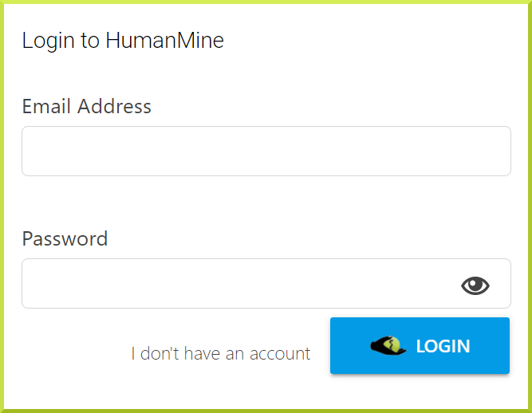

# Account

You need to create a different account for each InterMine database you use; we hope to support single sign-on in the future. You can access your account from the top navigation bar. 

### How do I create an account?

You can create an account through the Login tab in the top navigation bar. Click on the "**I don't have an account**" link in the previous screenshot to register by entering a valid email address and a password. 


Your account information is private and won't be accessible by other users. Account information won't be inspected beyond automatic performance optimisation and updates. You can read our [Privacy Policy](https://intermine.readthedocs.io/en/latest/about/privacy-policy/) for more details. 


### Profile

The account details tab allows you to set various aspects of your account as follows:

#### User preferences

**Inform me by email of newly shared lists:** Do you want to receive an email if someone shares a list with you? 

**Allow other users to share lists with me without confirmation:** Do you want users to be able to share lists with you without asking first?

**Display name:** Set the name displayed in your InterMine interface.

**Your preferred email address:** Set the email address you prefer to use for correspondence - for example**,** if someone shares a list with you. This could be different from the email you use to login to your account.

**The URL of your preferred Galaxy instance:** Results can be exported to [Galaxy](http://galaxyproject.org/) \(see [Send results to the galaxy](https://flymine.readthedocs.io/en/latest/results-tables/Documentationresultstables.html#resultsgalaxy)\). By default the main galaxy server is set, however, if you routinely use another galaxy instance you can set this to be the default here.

#### Password

You can change your password here.

#### Delete account

**API access key:**

API keys are used to access the features of the [InterMine API](https://intermine.readthedocs.org/en/latest/web-services/) without having to use your username or password.

### Are my lists and searches stored permanently?

Yes. When you have a MyMine account any lists or queries you save are stored permanently.

### What happens to my lists and queries when you make a new database release?

All lists and queries are transferred to the new database release. Sometimes identifiers in lists become outdated and you will be asked to update your list \(see [I am being told to upgrade my lists - what does this mean?](https://flymine.readthedocs.io/en/latest/lists/overview/Documentationlists.html#listsupgrade)\). Occasionally we have to make changes to the underlying data model which make affect any queries you have saved. Please contact the relevant InterMine \([Contact Us](https://flymine.readthedocs.io/en/latest/contact/Documentationcontact.html#contact)\) if you would like any further information or help about such a query.

