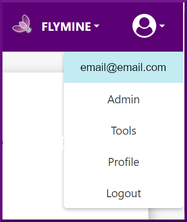
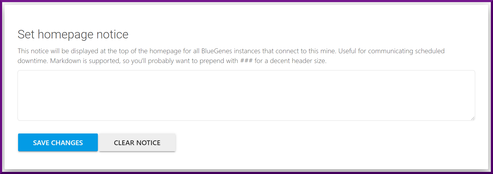

# Admin Account

In InterMine, there are two account types, **User and Admin**, that define your level of access to the interface and your permissions. By default, when you first create an account, you'll have the [User](account.md) role permissions. You can check the [account ](account.md)section for more details about the User account and its privileges. 

The administrator account has all [user](account.md) role permissions plus additional administrative capabilities that include access to the Admin Pages and the Tools Store. 

### The Admin Pages

#### Report pages layout

#### Homepage notice

As an administrator, you can set a homepage notice that will be displayed at the top of the homepage for all BlueGenes instances that connect to the current mine. This notice is useful for communicating important or urgent information, such as a scheduled downtime. 


Markdown is supported, so you'll probably want to use heading 3 or prepend with \#\#\# for a decent header size.


### The Tools Store

The Tools Store allows you to install analysis tools, view details about the previously installed ones, update all installed tools at once, or remove a particular tool. 

