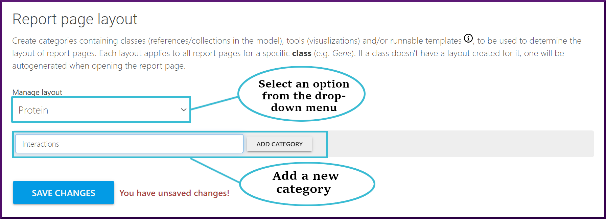
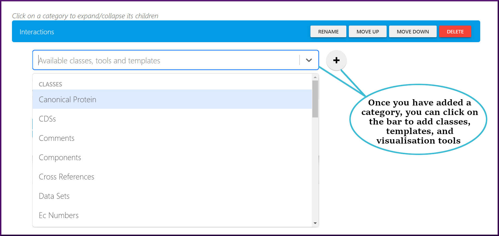
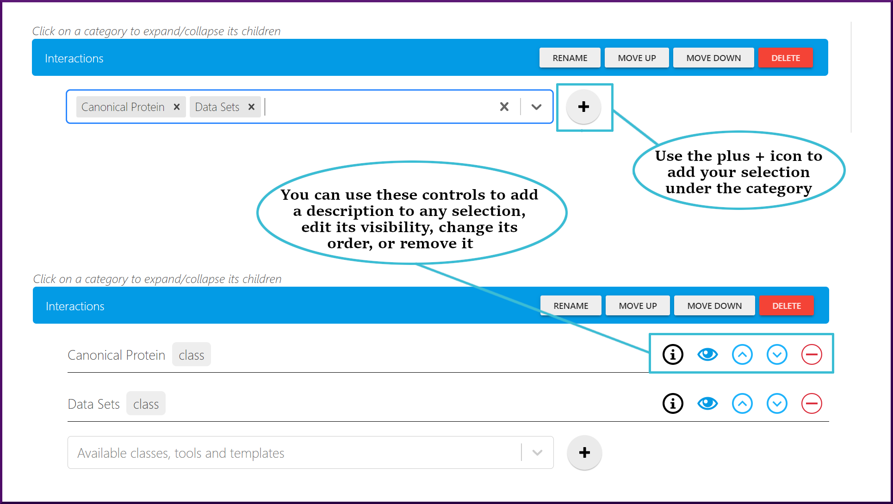
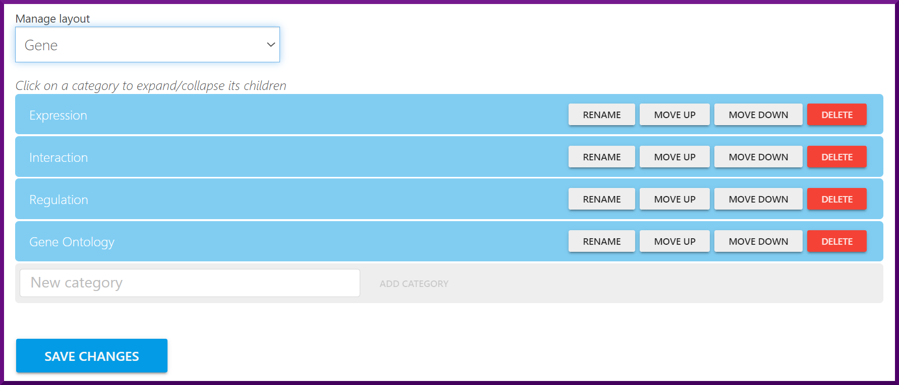
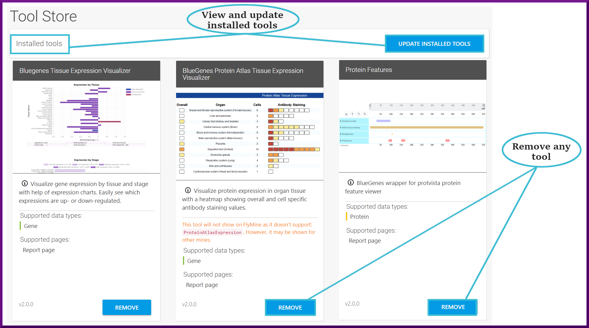

# Admin Account

In InterMine, there are two account types, **User and Admin**, that define your level of access to the interface and your permissions. By default, when you first create an account, you'll have the [User](account.md) role permissions. You can check the [account ](account.md)section for more details about the User role and its privileges. 

The Admin or Superuser role has all of the [user](account.md) role permissions plus additional administrative capabilities that include access to the [Admin Pages](https://app.gitbook.com/@user-documentation-intermine/s/user-documentation/content/user-documentation/admin-account#the-admin-pages) and the [Tools Store](https://app.gitbook.com/@user-documentation-intermine/s/user-documentation/content/user-documentation/admin-account#the-tools-store). 

### The Admin Pages

The Admin tab allows you to set and edit the Report Pages layout and create a notice at the top of the homepage to communicate any urgent updates, including maintenance or downtime.   

#### Report pages layout

Administrators can add categories containing classes - references or collections in the model, visualizations tools, and templates, to be used to determine the report pages' layout. Each layout applies to all report pages for a specific class, such as the Gene or Protein classes. 

To manage a layout, you need to select a class from the drop-down list. Then, you can add a new category, as shown below. 

Once you have added a category, you can click on the category bar to add classes, templates, and visualisation tools.

Admins can also rename any existing category, move it up or down, or remove it from the layout. When you're done with your selection, remember to click **“Save Changes”** at the bottom of the **“Report page layout”** section to save your changes.


If a given class doesn't have a previously created layout, one will be autogenerated when starting the report pages for that class.


#### Homepage notice

As an administrator, you can set a homepage notice, which will be displayed at the top of the homepage for all BlueGenes instances that connect to the current mine. This notice is useful for communicating important or urgent information, such as a scheduled downtime. 


Markdown is supported; it is recommended to use a heading 3 or prepend your notice with \#\#\# for a decent header size.


### The Tools Store

The Tools tab will direct you to the Tool Store, allowing you to install analysis tools, view details about the previously installed ones, update all installed tools at once, or remove a particular tool. 

