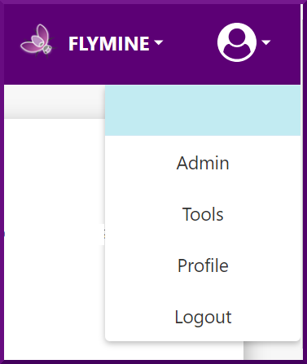

# Admin Account

In InterMine, there are two account types, **User and Admin**, that define your level of access to the interface and your permissions. By default, when you first create an account, you'll have the [User](account.md) role permissions. You can check the [account ](account.md)section for more details about the User account and its privileges. 

The administrator account has all [user](account.md) role permissions plus additional administrative capabilities that include access to the Admin Pages and the Tools Store. 

### The Admin Pages

### The Tool Store

