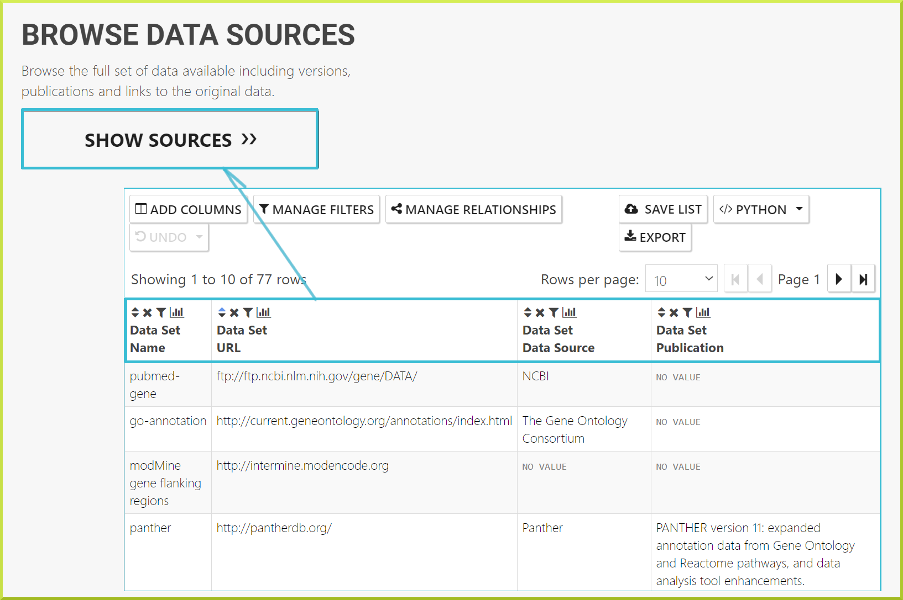

# Data Sources

#### Browse data sources

The BlueGenes application includes a link to all data sources on the homepage, which provides details of all data included in the database. This link applies to all InterMine instances. You can browse the full set of data available, including data set name, publications and links to the original data by clicking **Show Sources** button. The data sources will be displayed as a standard results table as shown below. 

### Data in the database

Within the database, the source of all data is stored in the data source and data set classes. The data source stores the main data provider \(eg a database\) and the data set is any individual sets of data from that data source. For example, an InterMine may load Gene Ontology data for several organisms from the Gene Ontology Consortium. The data source is the Gene Ontology Consortium, while the data for each organism will be recorded as a data set. Data sets and data sources can be included in the results of queries. This is particularly useful if the same type of data is loaded from different sources. For example, FlyMine loads interaction data from both Intact and BioGrid:

For more on how to add information to the results of a query see [Manage columns: Adding additional columns of data to your results](https://flymine.readthedocs.io/en/latest/results-tables/Documentationresultstables.html#resultsadddata), template modify or [The Query Builder](https://flymine.readthedocs.io/en/latest/query-builder/Documentationquerybuilder.html#querybuilder).

