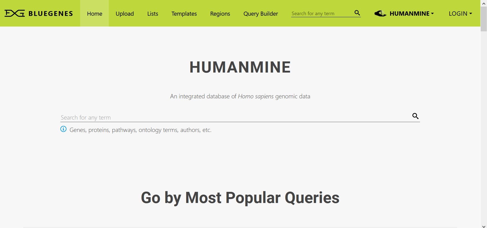

# Getting Started

Welcome to InterMine! This quick guide will walk you through the features and functions of the InterMine - BlueGenes UI. 

You can use this guide to:

* Take a general overview of the BlueGenes interface.
* Take a closer look at the key sections of the homepage.
* Understand the basics of using InterMine and its main sections 


This concise overview is geared mainly for new users. For more information about a particular topic, see the relevant section in the documentation. 


### The Basics

The InterMine query interface provides various ways to view and analyse data. Whether you are looking at a single gene, a list of genes, transcription factor binding sites, or protein interactions, it is useful to understand the following terminology to understand the interface. 

Intermine allows you to work with **single items \(objects\)** and **multiple items \(lists\)**:

* **Object:** A single item in the database. This can be anything, a gene, protein or binding site.
* **List:** Multiple items of the same type. For example, a list of genes or a list of proteins.

### Homepage sections

Below is a quick description of different sections in the BlueGenes homepage

* **Home**: the main page of the interface offering a search feature for any term, access to popular queries, documentation, the InterMine blog, external tools, and more.  
* **Upload**: to upload a new list as a free text or from an existing file. 
* **Lists**: A list in InterMine refers to multiple items of the same type - for example, a list of genes or a list of binding sites. 
* \*\*\*\*[**Templates**](keyword-search.md): a pre-defined query which offers a simple form with one or more variables for you to define; defaults are always provided so you can see exactly how the template works.
* **Regions**: a tool for looking at genomic regions and the features they contain. Allows you to upload a set of regions and search for features mapped to these regions.
* **Query Builder**: an advanced query building tool - you can use this to construct your own searches. You can even turn them into your own template searches.
* **Keyword Search**: a search box appears on the menu bar of all pages and the home page. You can search for any identifier, name, symbol or keyword.
* **HumanMine**: an integrated database of Homo sapiens genomic data. You can change HumanMine to a different InterMine instance. Check this [registry](http://registry.intermine.org/) for available instances.   
* **Account - MyMine**: MyMine is your personal InterMine account where you can manage your lists, queries, templates etc.  

### InterMine search tools

* [Keyword Search](https://flymine.readthedocs.io/en/latest/quick-search/Documentationquicksearch.html#quicksearch)
* [Template Searches](keyword-search.md)
* [The Query Builder](https://flymine.readthedocs.io/en/latest/query-builder/Documentationquerybuilder.html#querybuilder)
* [Region Search](https://flymine.readthedocs.io/en/latest/region-search/Documentationregionsearch.html#regionsearch)

### Viewing search results

To view data resulting from these searches, intermine provides the following interfaces:

* [Report Pages](https://flymine.readthedocs.io/en/latest/report-pages/Documentationreportpages.html#reportpages): a report page allows you to view all the information available for a particular object and provides links to related objects. 
* [List analysis pages](https://flymine.readthedocs.io/en/latest/lists/analysis/Documentationlistanalysispages.html#listanalysispage): every list has an associated list analysis page. A list analysis page is analogous to a gene report page and provides collated information about all the items in your list.
* [Results Tables](https://flymine.readthedocs.io/en/latest/results-tables/Documentationresultstables.html#resultstables): results tables not only for displaying your search results but are also powerful analysis tools, allowing you to summarise, filter, add or remove columns, create lists and download data.
* [Region Search Results](https://flymine.readthedocs.io/en/latest/region-search/Documentationregionsearch.html#regionsearchresults): the region search provides results in two formats: a genome browser and a table. 

### How everything links together

Although the above tools and interfaces are described separately; they all interact together in various ways. 

For example, you could run [Template Searches](keyword-search.md) to find all genes regulated by a specific transcription factor. From the resulting results table, you could [Upload a list](https://flymine.readthedocs.io/en/latest/lists/upload/Documentationlistupload.html#listupload) of these regulated genes. This list could then be analysed using the [List analysis pages](https://flymine.readthedocs.io/en/latest/lists/analysis/Documentationlistanalysispages.html#listanalysispage). You could also run further [Template Searches ](keyword-search.md)using this list as the input.

Alternatively, you may start by [Uploading a list](https://flymine.readthedocs.io/en/latest/lists/upload/Documentationlistupload.html#listupload) of genes. Through the graphs and tables provided on the [List analysis pages](https://flymine.readthedocs.io/en/latest/lists/analysis/Documentationlistanalysispages.html#listanalysispage), you may filter this set according to some criteria \(e.g. expressed in the brain\) to create a smaller list. You may then run a series of [Template Searches](keyword-search.md) or build your own queries using [The Query Builder](https://flymine.readthedocs.io/en/latest/query-builder/Documentationquerybuilder.html#querybuilder) to find out more about this set of genes. You may also browse the information available on the [Report Pages](https://flymine.readthedocs.io/en/latest/report-pages/Documentationreportpages.html#reportpages) for those genes that may look interesting to you! 

You may start by entering a gene identifier for a gene you have picked up in an experiment into the [Keyword Search](https://flymine.readthedocs.io/en/latest/quick-search/Documentationquicksearch.html#quicksearch) box and browsing all the information for this gene on its [Report Pages](https://flymine.readthedocs.io/en/latest/report-pages/Documentationreportpages.html#reportpages). From here, you learn that this gene has orthologues in fish, mouse and rat. You click the link for the mouse orthologue and, this takes you to the report page for this orthologous gene in a related intermine, MouseMine, and so on.

