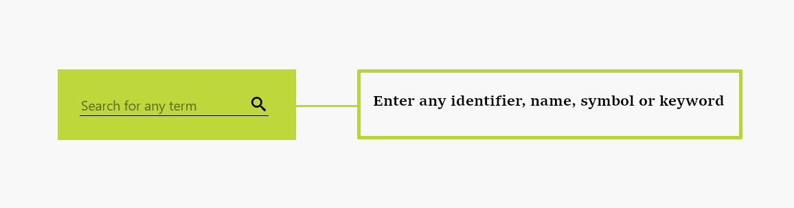
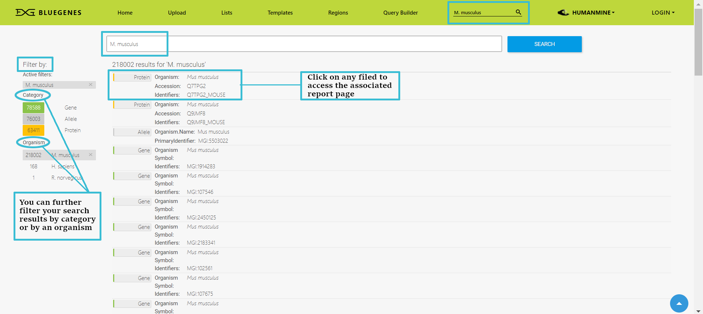

# Keyword Search

A search box appears in the top navigation bar of all pages and in the home page. You can search for any identifier, name, symbol or term.

Examples of what you can search:

* **Single terms:** to search for one term, such as Gene identifiers \(e.g FBgn0000606\), Gene names \(e.g. Notch\), Gene symbols \(e.g. eve\), Keywords \(e.g. Diabetes, embryo\), etc. 
* **Two terms:** to search for either of two keywords, use **OR** \(e.g. fly OR drosophila\)
* **Phrases:** to search for phrases use quotation marks - **“ ”** -   \(e.g. “DNA binding”\)
* **Boolean:** Boolean search syntax is supported using Boolean expressions: e.g. dros\* for partial matches or fly AND NOT embryo to exclude a term

The quick search will search all objects in the database for the term you enter. All objects that match the term are returned in an interface allowing you to further refine your search results. 

Results from any quick search link to [Report Pages](https://flymine.readthedocs.io/en/latest/report-pages/Documentationreportpages.html#reportpages) for each item found

