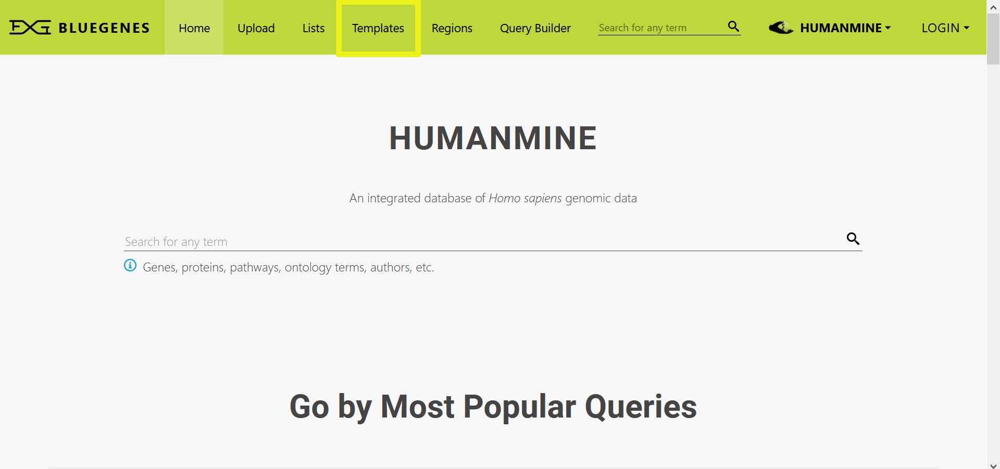

# Template Searches

### What is a template search?

A template search is a pre-defined query that has been created and is ready to use. Template searches allow you to search the database without constructing your own queries from scratch or understanding the underlying data structure. A library of template searches covering a full range of data is available.

A template search has a simple form with one or more entry fields. You can fill in these fields with your data or select a value from the available options. Each template uses default values for all required fields, allowing you to immediately run the query and check whether the search returns the data you want. Each template has a short name and an extended description underneath. The title helps you quickly scan available searches and find the one you need. The description provides more details, including any restrictions on the values you can use to run the query. To access the template library, click on the Templates tab in the main menu bar. 

### Finding the template search that you want

There is a long list of pre-defined searches, and checking all available templates can be time-consuming. So, to find your template of interest, you can filter the list by keyword/description or by data category. ****

If you are unsure which category to use as a filter, category tags are shown at the bottom right corner of each template preview. 

**Image**

### Running a template search

A template search provides you with a fillable form with one or more fields to set. Some entry fields may require entering a value, while others have a set of available choices in a drop-down list. Some templates offer optional search constraints that you can turn On and Off as desired. Once everything looks good, click **view &gt;&gt;** to further expand the template, view the results preview and the constraints window. 

**Image** 

To see all of the search results, click **view rows.**  

**Image** 

**Image**

### How do I run a template search with one of my lists or a public list?

First, remember to **log in** so that you can view and use your saved lists. You can run templates to search for a keyword in relevant [Lists](https://flymine.readthedocs.io/en/latest/lists/overview/Documentationlists.html#overview) of objects by selecting the **In list** option. 

**Image** 

If you have a list of the correct type \(e.g. a list of genes\) or there is a public one that matches your needs, you can choose your preferred list from the shown drop-down set. 

**Image**

### Understanding your results

Template searches return results in a tabular format. Besides displaying query results, results tables are also powerful analysis tools. Check the [Results Tables](https://flymine.readthedocs.io/en/latest/results-tables/Documentationresultstables.html#resultstables) section for more details on how to save or download your search results.

### Modifying a template search

Sometimes you may find that a template does not return everything you want in your results. Templates are a good starting point for building more complex searches. You can modify a template using [The Query Builder](https://flymine.readthedocs.io/en/latest/query-builder/Documentationquerybuilder.html#querybuilder) - click on **Edit Query** at the bottom of the **Results Preview** window to view the selected template in the query builder window. 

**Image** 

You need to understand how to use the query builder to modify your template - please check [The Query Builder](https://flymine.readthedocs.io/en/latest/query-builder/Documentationquerybuilder.html#querybuilder) section for more details. If you do not want to spend some time learning how to use the query builder, you can always [contact](https://intermine.readthedocs.io/en/latest/about/contact-us/) the InterMine team to help construct your desired search.

### Building your own template search

Coming soon……

### Can’t find what you want - let us know!

If you can’t find a template search that you want or available ones don’t entirely return everything you need, please do not hesitate to [Contact Us](contact-us.md). We can create a custom template for you or modify an existing one; assuming that the data is available in the database!

### TroubleShooting

#### My template returns no results - why?

All templates should return results with the default values provided. Please [Contact Us](contact-us.md) if you find any template that doesn’t.

* If you have entered your desired values and the template returns No Results in the results preview window, this means the data you are looking for is not available.
* For more complex searches with optional constraints, the way the search is constructed may affect the results - some of the required data might be missing resulting in no results. If you have activated multiple optional constraints, it is often a good idea to turn these On individually to see if one of them is causing the problem. By default adding a constraint means that the data **MUST** satisfy that constraint for the search to return results - take a look at [Outer Joins](https://flymine.readthedocs.io/en/latest/query-builder/Documentationquerybuilder.html#outerjoin) for more details about how constraints and joins can limit your results. 

Please [Contact Us](contact-us.md) if you require further assistance. 

