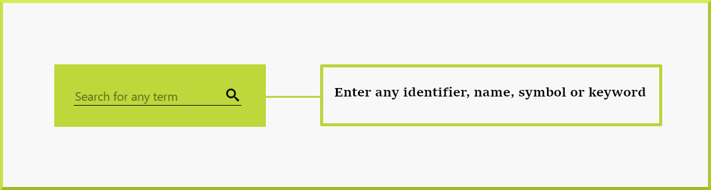
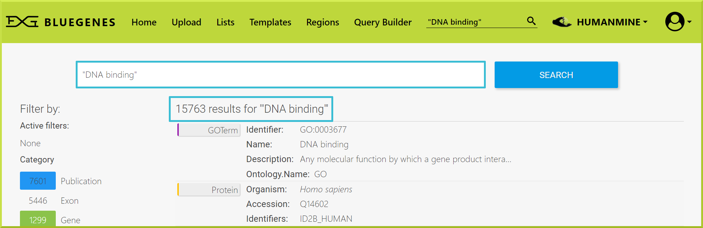
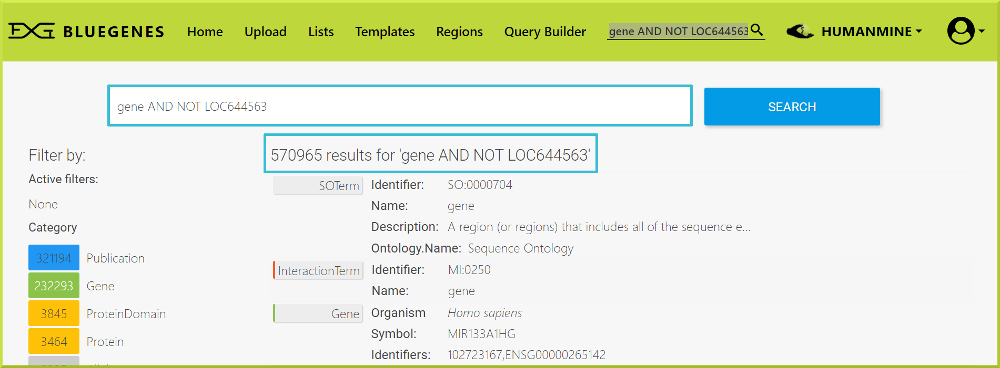
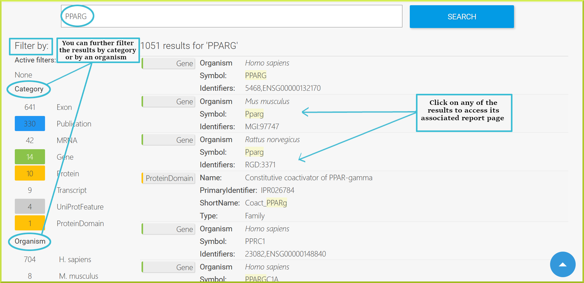

# Keyword Search

The BlueGenes' keyword search makes it fast and easy to find any keyword you need. A search box appears in the top navigation bar of all pages and the homepage. You can search for any identifier, name, symbol or term.

Examples of what you can search for:

* **Single terms:** to search for one term, such as Gene identifiers \(e.g. ENSG00000165695\), Gene names \(e.g. Adenylate kinase 8\), Gene symbols \(e.g. AK8\), Keywords \(e.g. Diabetes\), etc. 
* **Two terms:** to search for either of two keywords, use **OR** \(e.g. Gene OR PPARG\)
* **Phrases:** to search for phrases, use quotation marks - **“ ”** -   \(e.g. 

  “DNA binding”\)

* **Boolean:** Boolean search syntax is supported using Boolean expressions \(e.g. gen\*\) for partial matches or \(e.g. gene AND NOT LOC644563\) to exclude a term


Remember only use “**all capital letters**” boolean expressions to conduct a Boolean search. 


The keyword search goes through all objects in the database for any term you enter. All objects that match the term are returned in an interface, allowing you to further refine your search results.   

Results from any keyword search link to [Report Pages](https://flymine.readthedocs.io/en/latest/report-pages/Documentationreportpages.html#reportpages) for each item found. See the Report Pages section for more details about how to view information about a particular object. 

