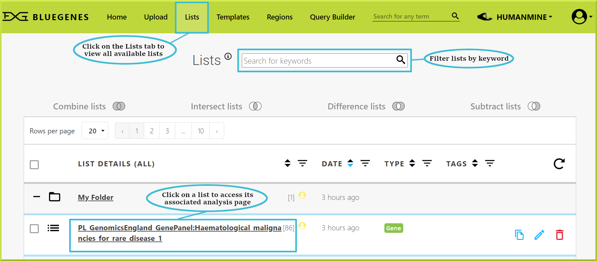
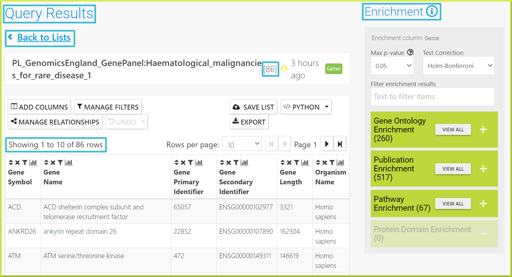
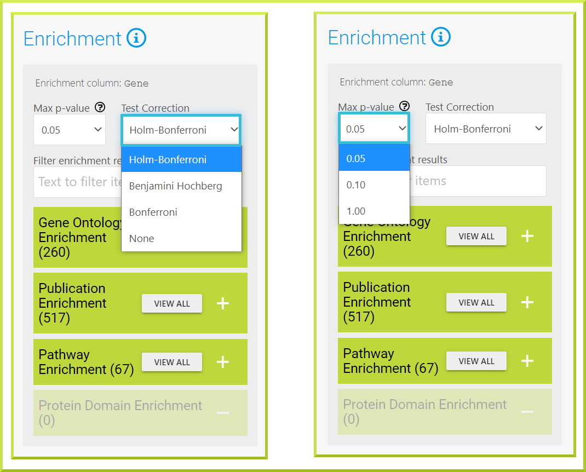

# List analysis

### Overview

Every list has an associated list analysis page. A list analysis page is analogous to a gene report page that provides collated information about all objects in a particular list. When you upload a new list, you will be automatically taken to its list analysis page. To access the list analysis page for public lists available in the database, click on the [Lists](lists.md) tab. Clicking on a list name will display its associated analysis page. 


Remember, you must be logged in to view your private lists!


### The list summary

The list summary provides the main identifiers for the objects in your list. For example, the next screenshot shows 86 rows for all 86 genes in the selected list. The list summary page is a form of Query Results - [Results Tables](https://flymine.readthedocs.io/en/latest/results-tables/Documentationresultstables.html#resultstables) that offers the full functionality of  Query Results - [Results Tables](https://flymine.readthedocs.io/en/latest/results-tables/Documentationresultstables.html#resultstables) page. It also includes the List **Enrichment Statistics** on the right of the analysis page, and the **GO-term Visualizer** at the bottom of the page. 


You can expand any enrichment widget or view the Go-term visualizer by clicking on the➕icon.  


### What does enrichment mean and how are the p-values calculated?

‘**Enrichment**’ means that a feature, such as GO term, domain, etc., occurs more frequently than would be expected by chance \(over-represented or significantly enriched\) for a given set of input genes. There are a number of different types of enrichment widgets, but all list a term, a count and an associated p-value. 

* The term can be something like a publication name or a GO term. 
* The count is the number of times that term appears for objects in your list. 
* The p-value is the probability that result occurs by chance, thus a lower p-value indicates greater enrichment. It is calculated using the hypergeometric distribution which is described further in the [InterMine documentation](http://intermine.readthedocs.org/en/latest/embedding/list-widgets/enrichment-widgets/). 

The InterMine enrichment widgets also provide three methods for test correction - **Bonferroni, Holm-Bonferroni and Benjamini Hochberg**. These are also described further in the [InterMine documentation](http://intermine.readthedocs.org/en/latest/embedding/list-widgets/enrichment-widgets/). 

### Why are some of my genes not analysed in an enrichment widget?

Often, a certain number of genes in an enrichment calculation cannot be included. This is because the data being analysed is not available for these genes. For example, not all genes have GO annotations or protein domains; they are therefore excluded from the analysis.

