# Lists

### Overview

A **list** in InterMine refers to multiple items of the same type - for example, a list of genes or a list of binding sites. A list cannot contain a mixture of types - e.g. genes and proteins. To access the lists library, click on the **Lists** tab in the main menu bar. 

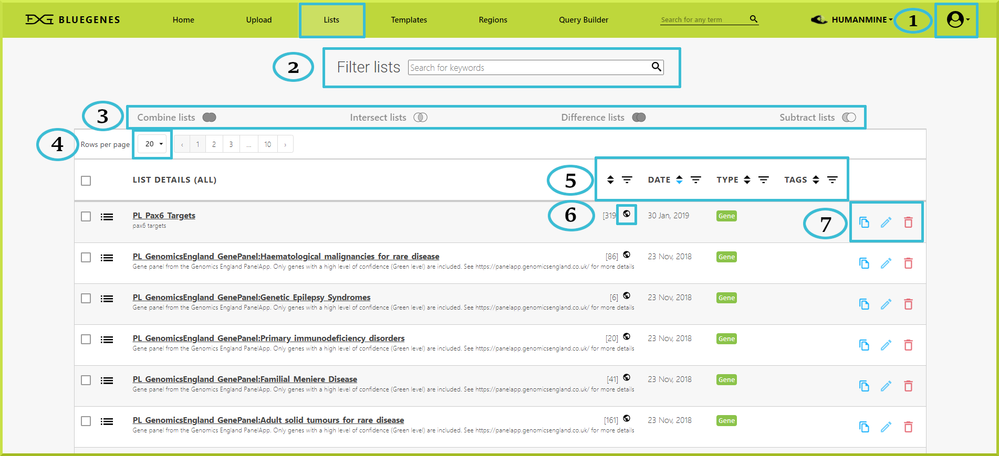

The following list is a breakdown of what each key item in your **Lists** tab means: 

1. You need to be logged in to your InterMine accountto have access to your stored lists and to accomplish certain tasks that are not available to guests, including copying, editing and deleting lists. 
2. You can filter lists by typing in any keyword in the search field.
3. You can analyse your lists using the given set operations. These operations are inactive by default, and you need two or more lists to activate them. Please check [List set operations](https://user-documentation-intermine.gitbook.io/user-documentation/content/user-documentation/lists/lists#list-set-operations) ****for more details.
4. You can control the number of rows shown per page to 20, 50, or 100
5. You can sort lists by date, type, tags, etc. 
6. This iconrepresents a public list. 
7. Controls to copy, move or delete a given list or a group of lists

### Public lists 

A public list is a list that has been created by InterMine developers and is ready for use. For example, FlyMine has public lists for sets of transcription factors in _Drosophila_. You can use these publicly available lists for analysis or run a particular search. 

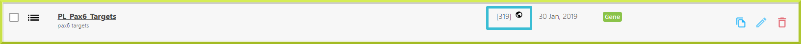


You cannot modify a public list. You need to make your own copy of a particular public list before you can edit it. Please check [How do I copy a list?](https://user-documentation-intermine.gitbook.io/user-documentation/content/user-documentation/lists/lists#how-do-i-copy-a-list) for more details.


### Creating lists

Lists can be created internally - for example, from [Results Tables](https://flymine.readthedocs.io/en/latest/results-tables/Documentationresultstables.html#resultstables) or [Region Search](https://flymine.readthedocs.io/en/latest/region-search/Documentationregionsearch.html#regionsearch). They also can be uploaded from an external source via [Upload a list](upload-a-list.md). 


Remember that you need to have an account prior to copying or storing any lists.


### Viewing lists

By default, when you click on the **Lists** tab, all of your lists will be shown.  Just remember, you need to be logged in to view your private lists. To filter your lists, you can use one of the available filtering options, such as date, tags, etc., shown in the next screenshot. 

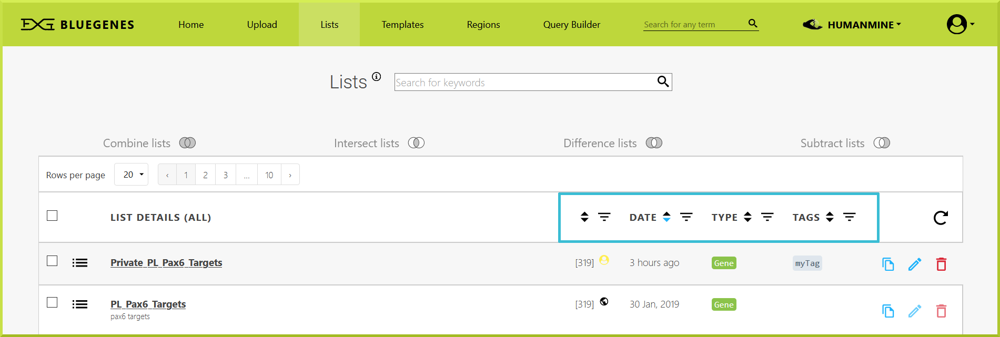

For example, you can select to only view your private lists, public lists, lists saved in a particular folder first, or all of your lists at once by using the dropdown menu shown in the following screenshot. Check the Creating folders section for more details about how to make new folders. 

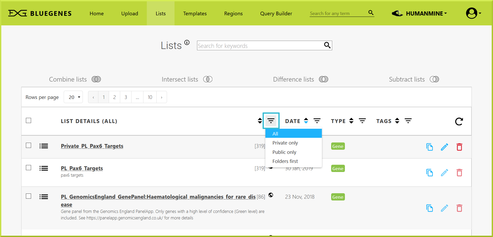

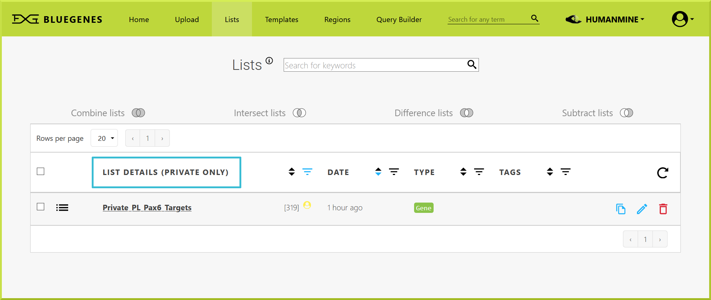


remember to log in to your account to view and manage your private lists


### Managing lists

You can manage your lists through the **Lists** view page. While logged in to your account, you can delete, rename, and upgrade a list, if your identifiers have become outdated.

### List tags

Tags can be used to organise your lists into categories. You can add your preferred tags to your saved lists by clicking on the **Edit list** icon✏in the **Lists** view page. 

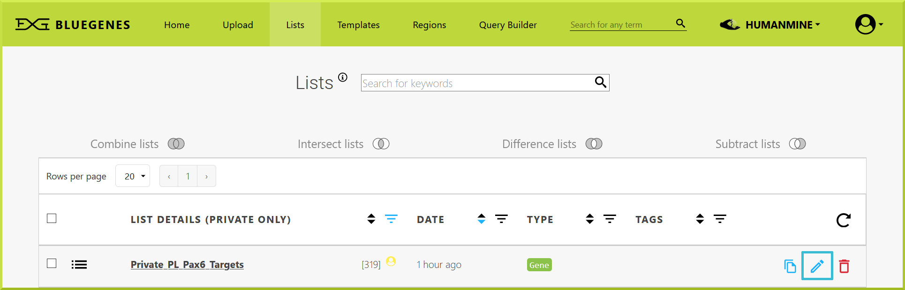

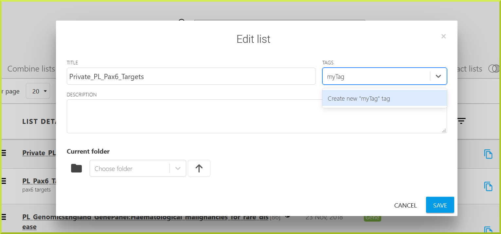

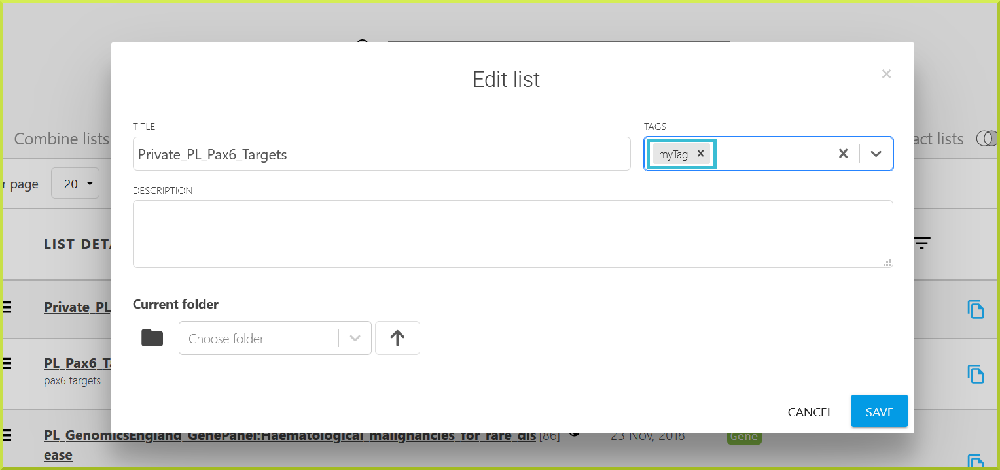

You can then filter your lists by one of the available tags in the **Lists** view page. 

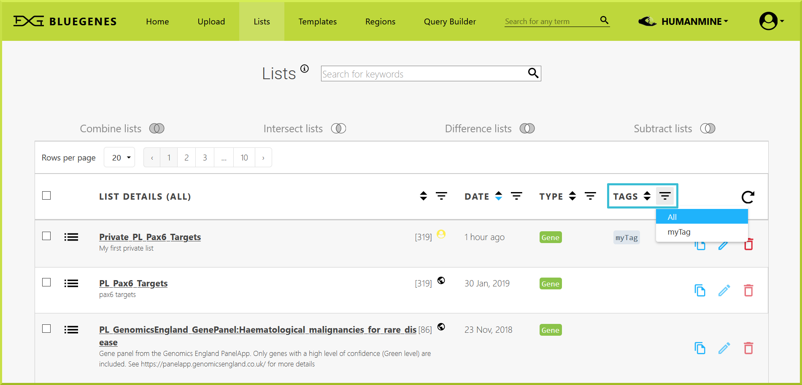

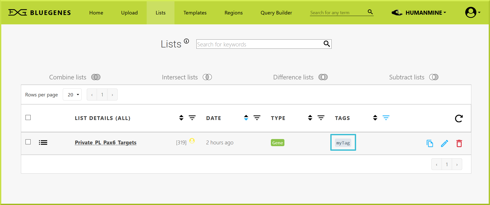

### Using lists in searches

You can run searches on a list, such as a [template search](../template-search.md) or a search you have built using the query builder. For example, you may want to run a search to find all the GO terms for a list of genes. You can use lists in your searches in the template form - in list option. Check [How do I run a template search with one of my lists or a public list?](https://user-documentation-intermine.gitbook.io/user-documentation/content/user-documentation/template-search#how-do-i-run-a-template-search-with-one-of-my-lists-or-a-public-list) for more information.

### List analysis

All lists have an associated [List analysis pages](list-analysis-pages.md), which provide a summary of your lists and several analysis tools. Besides, it is possible to carry out powerful analysis using lists' set operations, including union, intersect, subtract and symmetric difference. Please see [List set operations](https://user-documentation-intermine.gitbook.io/user-documentation/content/user-documentation/lists/lists#list-set-operations) for more details.

### List set operations

Sets of lists can be analysed using the **Combine**, **Intersect**, **Subtract** and **Difference** functions. These set operations are available in the Lists view page. 

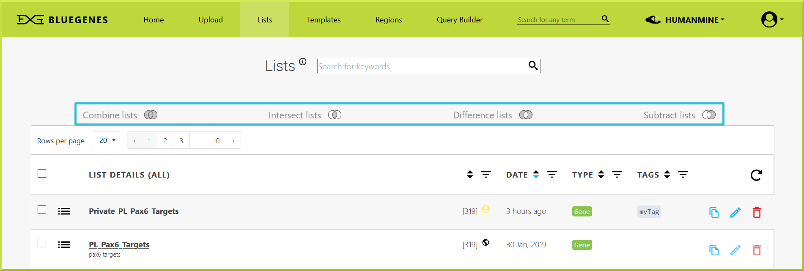

To use any of these functions:

> 1. Select two or more lists you wish to analyse
> 2. Select one of the functions
> 3. Provide a name for your resulting list
> 4. Click Save New List
> 5. Your results will appear as a new list at the top of the Lists view page

For example, you can combine two lists and save the new list as **My\_New\_List**. 

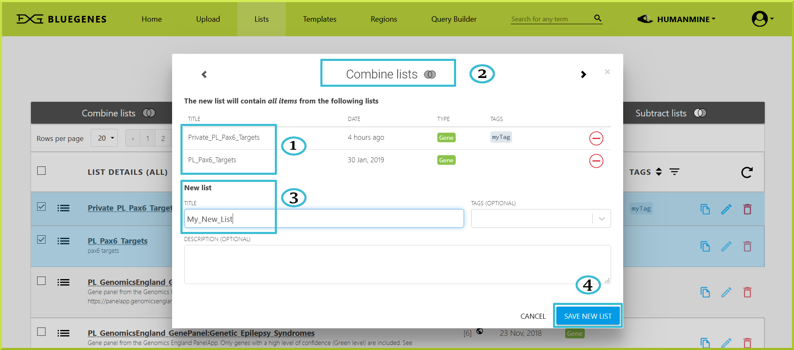

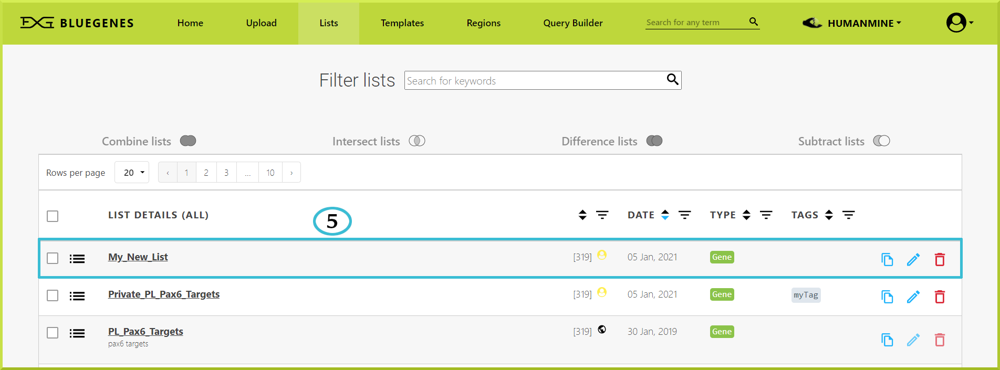

The BlueGenes interface offers four operations on sets for constructing new lists from given lists


**Combine lists**: this is more of a traditional ‘**add**’ function, in that the resulting list will contain **all objects** from all selected lists. For example, if you have list A and list B, you can use the Combine function to create a new list containing all items in both lists - i.e. A + B.



**Intersect lists**: this function creates a list that includes only items **common** to all given lists. For example, if you have list A and list B, you can use the Intersect function to create a new list containing only elements that exist in both A and B.



* **Difference lists**: this function performs a [**mathematical symmetric difference**](https://en.wikipedia.org/wiki/Symmetric_difference) ****on all selected lists, and the resulting list will contain only items unique to each of those lists. It is more like the opposite of an intersection operation. For example, if you have list A and list B, you can use the Difference function to create a new list that includes objects only appearing in either A or B.



* **Subtract lists:** this is more of a traditional ‘**subtract**’ function, in that the resulting list will contain objects that exist in one \(_**or group**_\) of the lists only. For example, if you have list A and list B, you can use the Subtract function to find unique items in list B. Note that this function gives you the option to perform the subtraction either way - i.e., A-B or B-A.


### Copying lists

You can copy a list from the **Lists** view \([How do I view my list?](https://user-documentation-intermine.gitbook.io/user-documentation/content/user-documentation/lists/lists#how-do-i-view-my-lists)\) page. 

1. You can select one list and click on the copy ****iconat the right of each list.
2. You can also use the checkboxes on the left of each list to select multiple lists at once
3. You can copy several lists using the **Copy All** option shown in the menu at the bottom of the page.

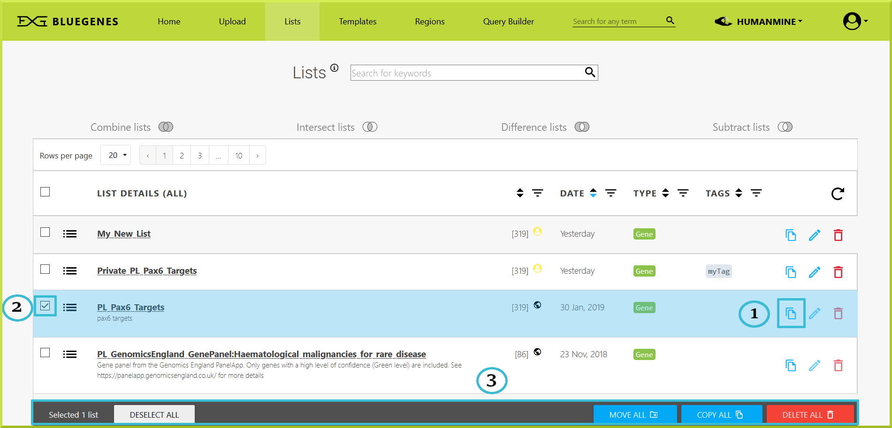

You can click **Copy List\(s\)** to make a copy of the list or click **Cancel** to return to the **Lists** view page. Please note that lists can also be copied to a particular folder. Check the Creating folders section for more details about how to make new folders. 

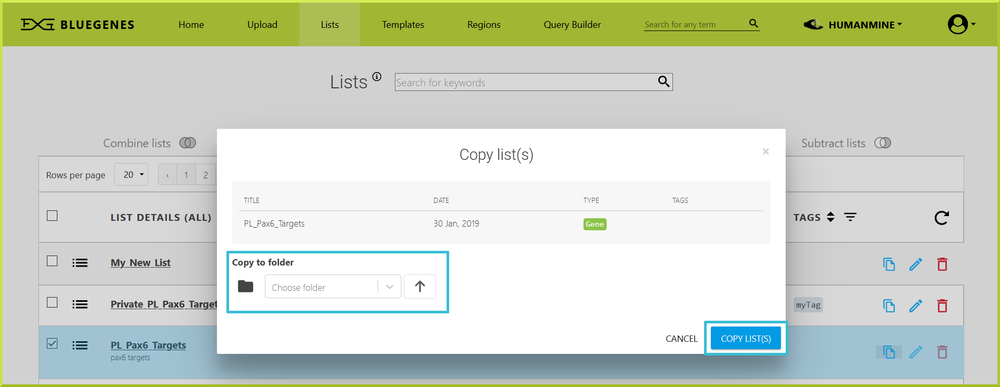

 A new list will be created with the same name and an underscore number. You should see a message at the top of the page informing you of the new list that has been created, and the copied list will show at the top of the **Lists** view page. You can then change the given name of the copied list to any preferred name; please see [How do I rename a list?](https://user-documentation-intermine.gitbook.io/user-documentation/content/user-documentation/lists/lists#how-do-i-rename-a-list) for more details. 


remember to log in to your account to copy any list\(s\)


### Renaming a lists

To rename a list, you must be logged in to your user account. Click on the Edit list ✏ icon on the far right of the list's name. 

A fillable form will be shown that you can use to change the title - the name of the list,  provide a description, and to add any tag\(s\). 

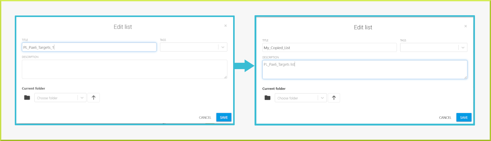

### Downloading lists

Lists can be downloaded from the **Lists** view page. You can select any particular list, and you will be taken to the list's detailed results table page. 

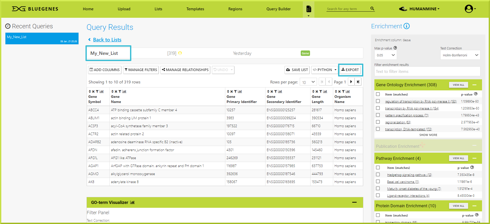

You can click the **Export** button on the right of the resulting table to download the results to your device. You can export the results ****in different formats, such as tsv, csv, or fasta.  

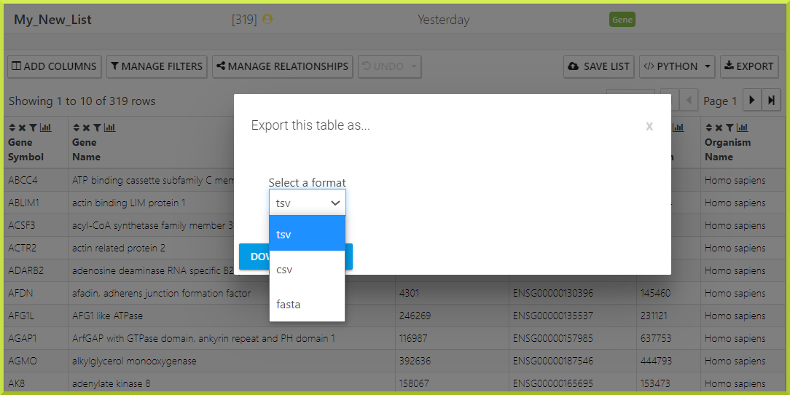

### Deleting lists

You can delete a list from the **Lists** **view** page. 

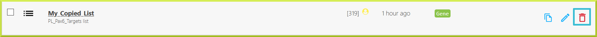

Select any list you want to delete and click on the **delete** icon to delete that list permanently.

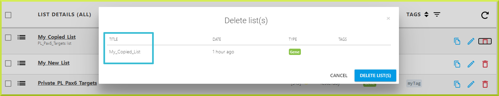


Please note that deleting a list is an irreversible action, and it only applies to your own lists!


### Creating folders

All public and private lists are shown in the **Lists** view page, and no folders exist by default. 

You can create new folders as part of [copying](https://app.gitbook.com/@user-documentation-intermine/s/user-documentation/~/drafts/-MQlo5xE8fGV8IneUfjG/content/user-documentation/lists/lists#copying-lists) a list. For example, you can select any list that you want to copy into a folder, and click on the copy ****iconat the right of that list. You can then type any preferred folder name in the **Choose folder** input field and enter to create a new folder. 

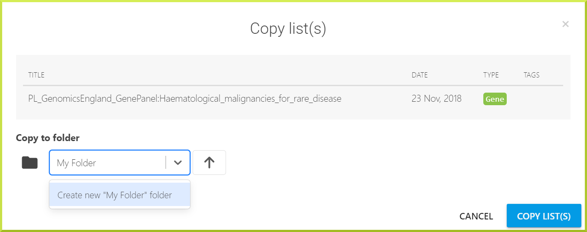

Click on **Copy List\(s\)** to make a copy of the list inside the new folder, **My Folder**. 


Click the arrow⬆icon to cancel copying the list into the new folder, and delete the newly created folder.  


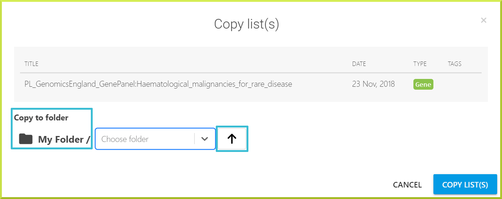

The new folder will be shown at the top of the Lists view page. 

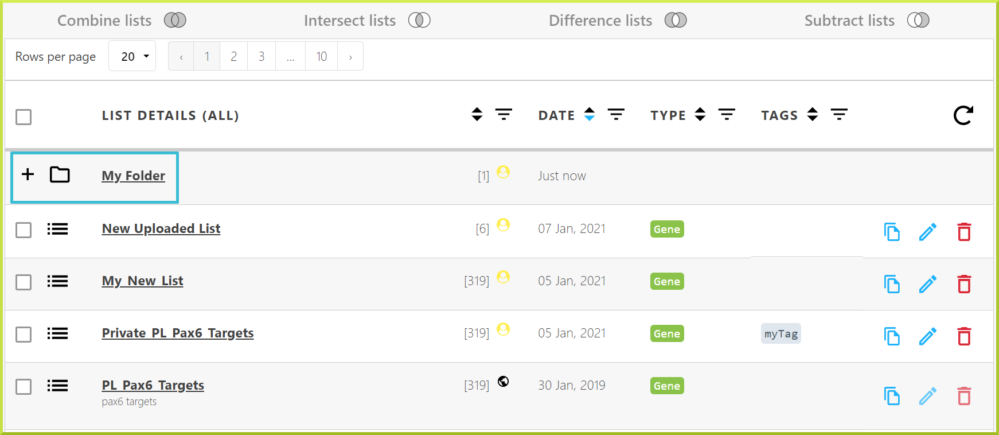

To view the contents of any folder, click on the folder's name or the➕icon to the left of that folder. The contents of any folder are usually displayed between light blue lines. 

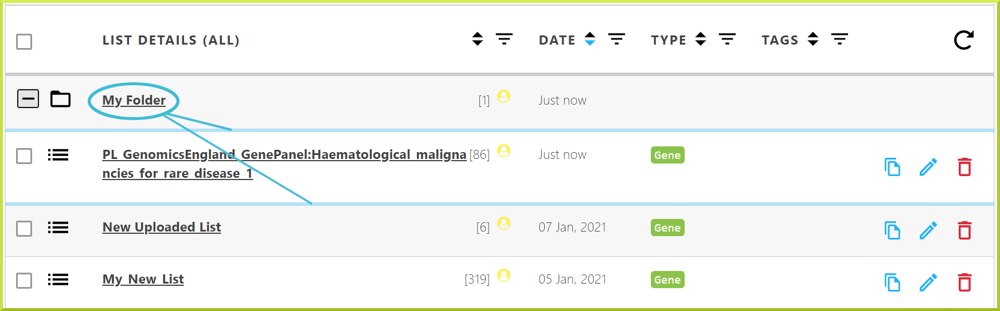

New folders can also be created when moving a list or a group of lists. For example, you can use the checkboxes to select multiple lists and then copy or move the selected lists to a new folder using the **Copy All - Move All** options shown in the menu at the bottom of the page. Then follow the same previous steps to create the new folder. 

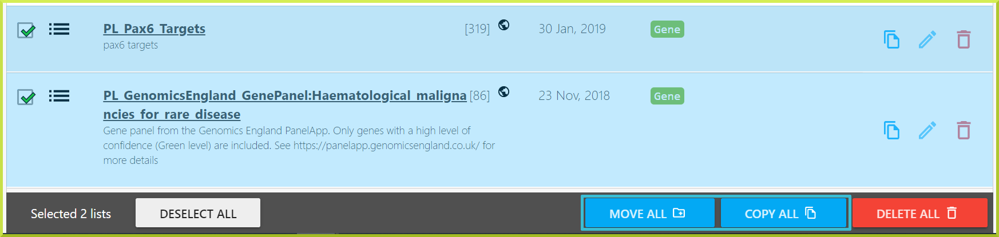


Please see the [Copying lists](https://app.gitbook.com/@user-documentation-intermine/s/user-documentation/~/drafts/-MQlo5xE8fGV8IneUfjG/content/user-documentation/lists/lists#copying-lists) section for more information about making a copy of a given list


### TroubleShooting

#### I am being told to upgrade my lists - what does this mean?

Every time we make a new release of an InterMine database, it is possible that some of the gene models have changed, which means that some of your identifiers might become outdated. For example, a gene may have been split; in this case, an identifier may now refer to more than one gene. Often a gene model is just updated, and the old identifier becomes a synonym while the gene is assigned a new identifier. When we make a new release, all of the identifiers present in your saved lists will be checked against the new database’s identifiers. When any discrepancies are found \(i.e. if any have now become synonyms or refer to more than one gene\), you will be asked what you want to do about these genes before using your list again. 

A message appears at the top of any page informing you that you have lists that need an update. To update your lists, you must be logged in to your user account. Within the Lists view page, lists that need to be updated will be shown first. The list upgrade system is the same as The Identifier Resolution page you see when you upload a list.

