# The Query Builder

The Query Builder is InterMine’s custom query building interface,  allowing you to create and save your own searches. Users usually use this flexible interface to construct their own data mining queries. The QueryBuilder lets you view the data model, apply constraints, and select your preferred output. To access the query builder, click on the **Query Builder** tab in the top navigation bar. 


### Overview

The query builder page is divided into several sections as follows:

* **The Model Browser**
* **The Data Browser**



The **Model browser** helps you find and add your data of interest.


1. The class field to browse through available classes. For example, the screenshot shows the **Gene** class with its associated attributes, such as **Length**, **Name**, **Primary Identifier**, etc. 
2. You can click the **Browse** button to be directed to the **Data browser tree** to browse all class names. Clicking on any class name will take you back to the **Model browser** with that class selected in the class field. 
3. You have some controls to manage the selected class's data. You can use **Summary** to summerise the selected class by adding its common attributes, **Expand** to expand the **Model browser tree** showing all selected attributes, **Collapse** to fold the **Model browser tree** to the top level and **Clear** to remove all selected attributes. 
4. Use **checkboxes to** add individual fields - attributes - to your results. 
5.  Expand more fields underneath class a using the➕sign. 
6. Click **Summary** to add a summary of common fields to the results table.  



* when you click the **Browse** button in the **Model browser**, you are directed to the **Data browser tree** to browse all class names. Clicking on any class name will take you back to the Model browser with that class selected in the class field. You can also switch back to Model browser when you click the **Back To Model** button.  ****

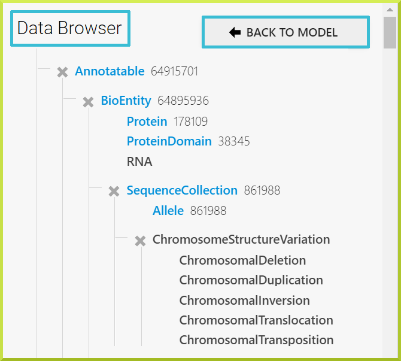



* **The Query Editor tab**
* **The Manage Columns tab**



* The **Query Editor** tab allows you to edit your query by adding filters - constraints - to any column or remove selected classes or attributes. 





* The **Manage Columns** tab lets you manage the order of selected columns in your results and sort data in each column alphabetically in ascending or descending order. 





* **The Preview tab**
* **The XML tab**



* The **Preview** tab lets you view how the results of the query under construction will look like. 

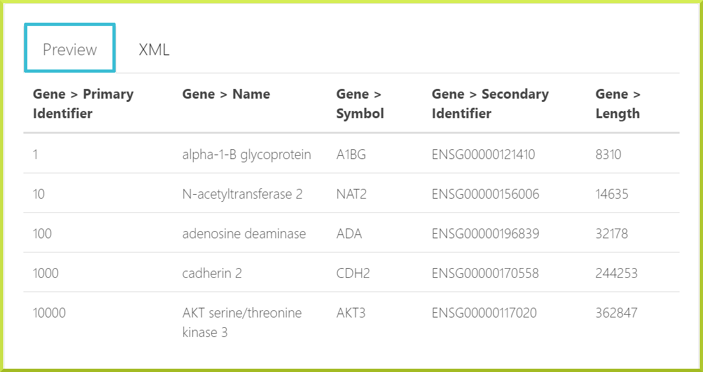



* The **XML** tab lets you view and copy queries in XML format to share them with others or save them for later. 





* **The Recent Queries tab**
* **The Saved Queries tab**
* **The Import from XML tab**



* The **Recent Queries** tab displays recent queries you run. 

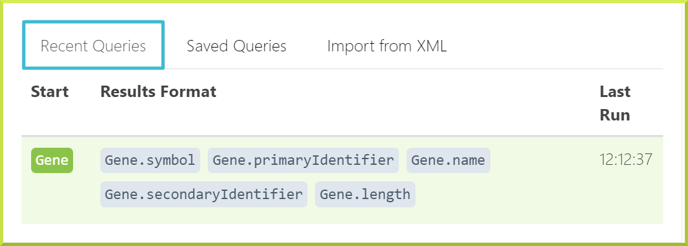



* When you successfully save a query, a confirmation message will be shown, and you can view saved queries under the **Saved Queries** tab. 


* To the right of each saved query, there are three actions associated with each saved query - **Load**, **Rename** and **Delete**. For example, you can use the **Load** action to load a query in the **Query Editor** tab.

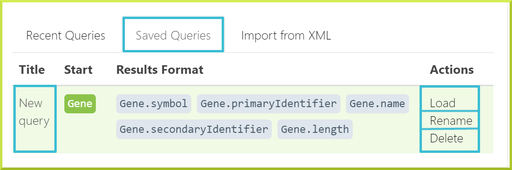

* You can change the name of any saved query using the **Rename** option. 

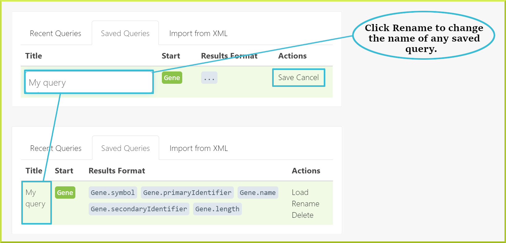

* You can remove a query through the **Delete** action. The deleted query can be restored through the link in the confirmation message shown in the following screenshot.  

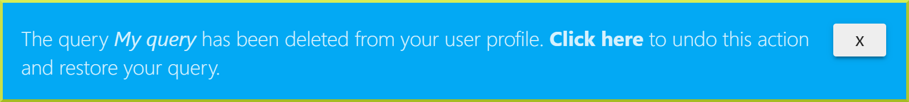


Deleting a saved query cannot be undone once the confirmation message is no longer active. 




* You can also import a query by pasting the query XML in the input field and click **Load Query** under the **Import from XML** tab. 

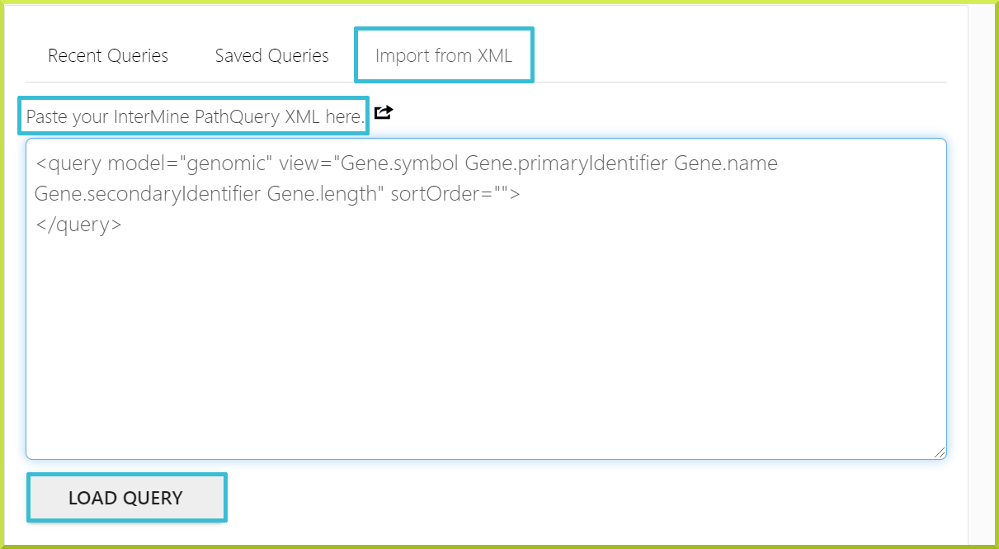



### Constructing queries

To build a query, you must first decide on a starting point - class - to start your query.


By default, the query starting point defaults to **Gene** and can be changed with the **Model Browser's** dropdown list. 


There are three steps to construct a query, which you can repeat for any additional data required:

1. Navigate the model/data browser to find the class or attribute you need.
2. Add the appropriate constraints - or filters - to selected class/attribute.
3. Decide on the columns you want to view in your results.

 These steps are explained in more details below. 

### Navigate the data browser

As mentioned earlier, the query builder's left-hand pane is called the **Model Browser**, which allows you to navigate through all the data classes from your defined starting point. So, you must first decide on a starting point - or a class - from which you can start your query. Classes are linked through logical references - for instance, you can navigate from genes to proteins, transcripts and microarray data etc. Classes and references will vary for each InterMine. Every class of data has certain attributes - fields - associated with it. For example, a gene has a primary identifier, name and symbol, among others. Use the model browser to navigate to the data you are interested in. For example, to get to **Protein domain** from **Gene** as the starting point, you would expand the **Protein** class first and then the **Protein domain** class. For each class and attribute in the model browser, there is a **checkbox** that you can use to add - or remove - a given class or attribute from your results.

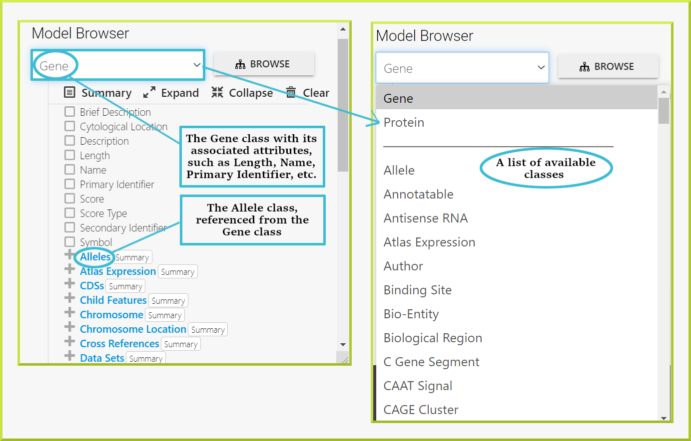

### Add a constraint - filter - to your query

Once you have navigated to the data you want to search, you can now add a constraint to filter your results and only return the data you are interested in. For example, if you want to return all genes involved in diabetes, you would first select the **Gene** and **Diseases** classes through the **Model Browser**. 

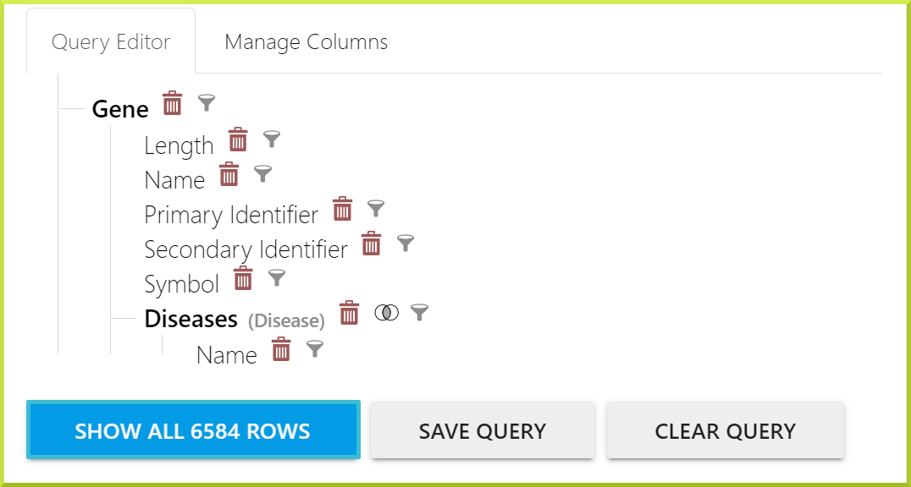

Then add a constraint to the **Diseases** class's **Name** attribute,  limiting your results to only those genes associated with diabetes.

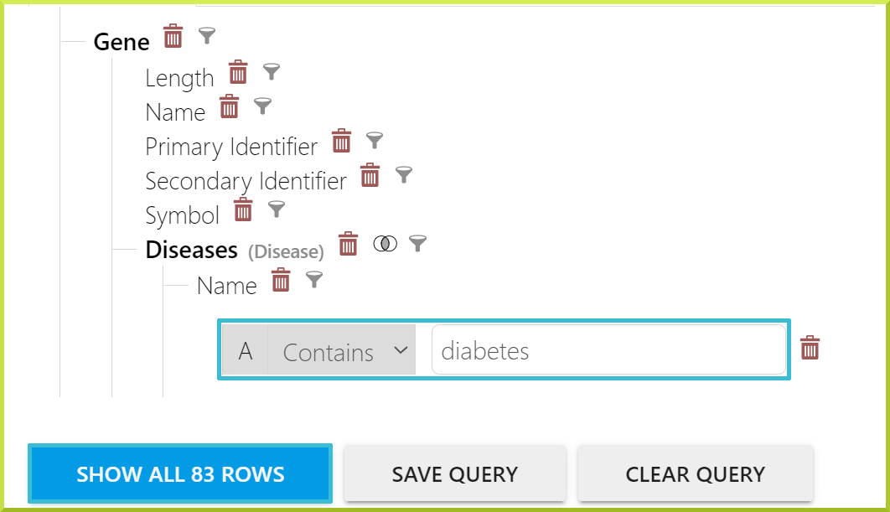

The type of constraint you can add depends on the class and attribute selected. For some constraints, you may have to type in some text; while others may require you to select from a drop-down list. Some will allow you to choose a list of saved objects, such as a list of genes. You can add as many constraints as you wish to build up your query. The set of constraints you add is shown in the right-hand pane of the Query Builder - specifically under the **Query Editor** and **XML** tabs. 

Remember that you are building a query from scratch so you may need to put in constraints to limit the organism or the set of genes. For example, the following screenshot shows a query under construction - without any constraints, the expected results are 232429 rows. 

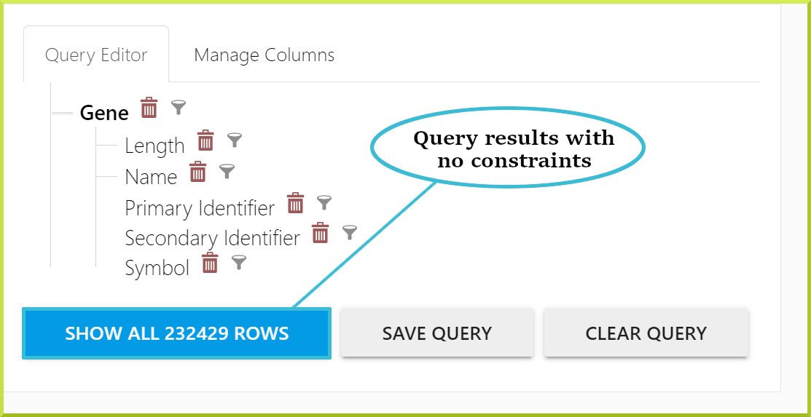

Adding one constraint to lookup the **PPARG** gene in the previous query limits the search results to only three rows. 

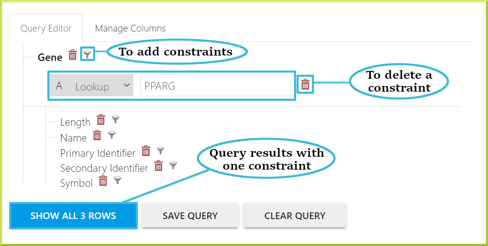

Constraints are also shown at the bottom of the query's XML format as follows:

```text
<query model="genomic" view="Gene.symbol 
       Gene.primaryIdentifier Gene.name 
       Gene.secondaryIdentifier 
       Gene.length" constraintLogic="(A)" 
       sortOrder="">
   <constraint path="Gene" value="PPARG" 
       op="LOOKUP" code="A"/>
</query>
```


Constraints are assigned capital letters as their labels; so, your first added constraint will be called A, the second will be called B, and so on.


Most InterMine instances contain gene data from more than one organism even if their data focus is a specific organism. For example, HumanMine has gene data for human, mouse and rats. Therefore, when constructing a query from scratch, it often makes sense to add an organism constraint. For instance, we can add an extra constraint to the previous example to limit the data to the **Homo Sapiens** organism only as shown in the following screenshot. 

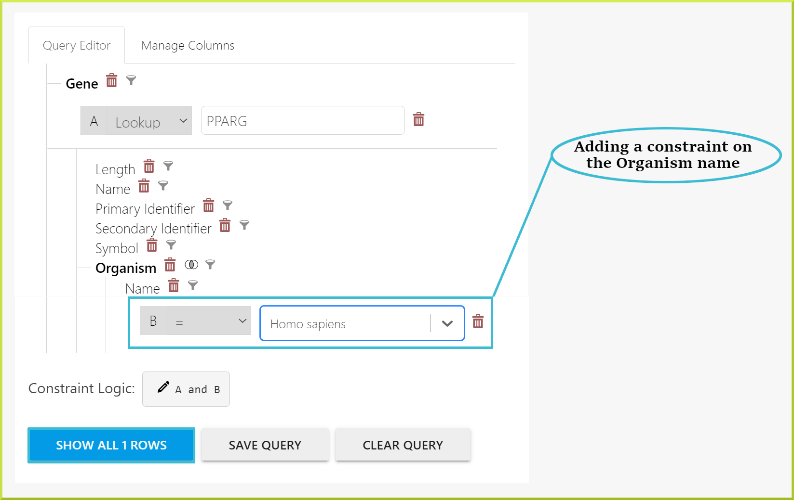

### Choose the data you want in your results.

Every attribute has a **checkbox** on the left that you can tick✅to add that attribute to your query output. All selected attributes will become columns in your results table when you run your search. For example, if you want to return all genes involved in diabetes, you would first select the **Gene** and its common attributes using the **Summary** button. You can then add the **Diseases** class and its name attribute using the checkbox shown in the screenshot below. 

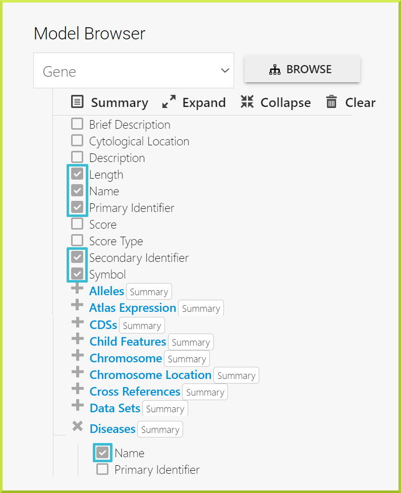


Columns are shown - and can be removed - under the [Query Editor](https://app.gitbook.com/@user-documentation-intermine/s/user-documentation/content/user-documentation/the-query-builder#the-query-builder-sections) tab. 


### Run your search

Once you are happy with your query and the attributes you have selected for your results, press **Show All Rows** to run your search. Your results will be displayed in our [Results Tables](results-tables.md). 

## Advanced features of the query builder

### Subclasses

Some classes have subclasses, which are more specialised sets of the main class. For example, the **UTRs class** in HumanMine has two subclasses **Five Prime UTR** and **Three Prime UTR**. To constrain a class to its subclass, click on the class name and select the subclass from the drop-down list. Classes which have subclasses are indicated as shown below. 

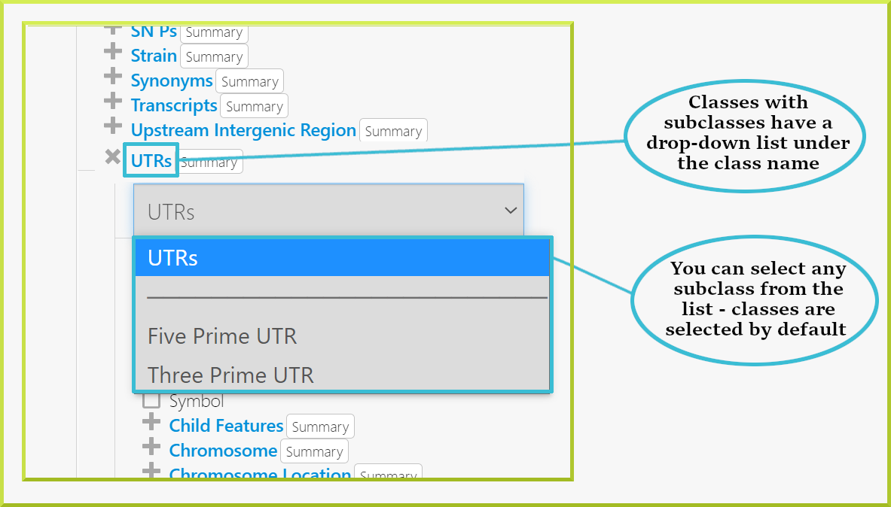

### Outer joins

When adding a constraint to a query, you also need to consider whether you want this filter to limit your results to only show items that satisfy the added constraint or show all items in the query results while indicating which records satisfy the filter. For example, if you are adding a constraint to the Gene class, and selecting to show any associated pathway\(s\) for a given gene \(or list of genes\), you need to consider whether you want your results to show:

1. Only genes if they have a pathway \([**Inner join**](https://towardsdatascience.com/what-is-the-difference-between-an-inner-and-an-outer-join-in-sql-5b5ec8277377)\)
2. All genes and pathways and indicate which genes that have associated pathway\(s\) \([**Outer join**](https://towardsdatascience.com/what-is-the-difference-between-an-inner-and-an-outer-join-in-sql-5b5ec8277377)\)

The default constraint is always **1,** or **inner join**, which means that only columns that satisfy the constraint\(s\) are shown in the query results. You can change the logic to **2** using the **outer join**. To do this, add your constraint in the usual way, and edit the logic to outer join by clicking the intersection set symbol to the right of a class name in the **Query Editor** as shown in the following screenshots. 

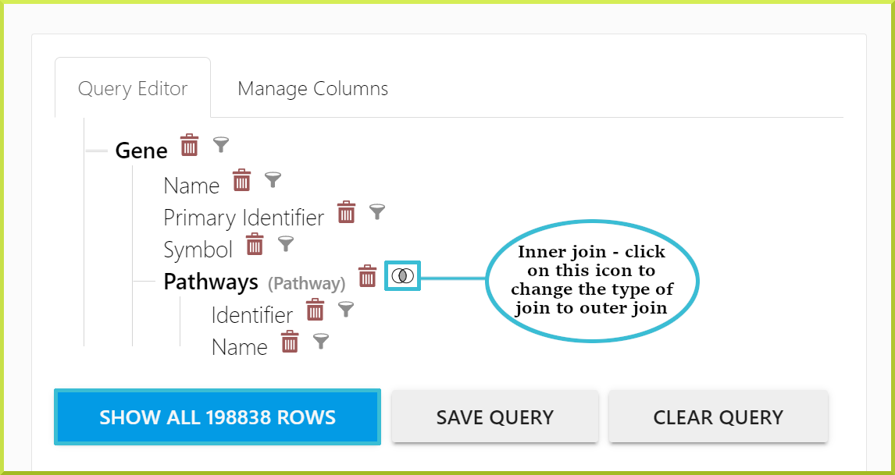



* Note that the column summary and filtering still applies to the results table as a whole. 
* The outer join constraint represents a [full outer join](https://en.wikipedia.org/wiki/Join_%28SQL%29) in database systems.  


### Loop queries

Coming soon. 

### Constraint logic

You can set the constraint logic for your query under the [**Query Editor**](https://app.gitbook.com/@user-documentation-intermine/s/user-documentation/content/user-documentation/the-query-builder#the-query-builder-sections) tab. Each constraint is assigned a letter, which is shown along with the constraint logic at the bottom of the [Query Editor](https://app.gitbook.com/@user-documentation-intermine/s/user-documentation/content/user-documentation/the-query-builder#the-query-builder-sections) tab. The constraint logic accepts: **AND** and **OR** and **NOT** logic and can be edited using the✏icon as shown in the next screenshot: 

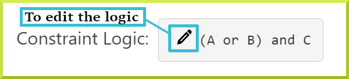


By default constraint logic is set to AND 


### Sorting

By default, results are sorted on the contents of the first column. However, sorting and reordering columns can be changed under the **Manage Columns** tab. Check the [**Query Editor**](https://app.gitbook.com/@user-documentation-intermine/s/user-documentation/content/user-documentation/the-query-builder#the-query-builder-sections) tab at the top of this page for more details about sorting and ordering columns. 

### Saving and exporting your query

If you are logged in, you can save a query you have constructed permanently under the **Saved Queries** tab. The **Save Query** button is found at the bottom of the [**Query Editor** ](https://app.gitbook.com/@user-documentation-intermine/s/user-documentation/content/user-documentation/the-query-builder#the-query-builder-sections)tab. 

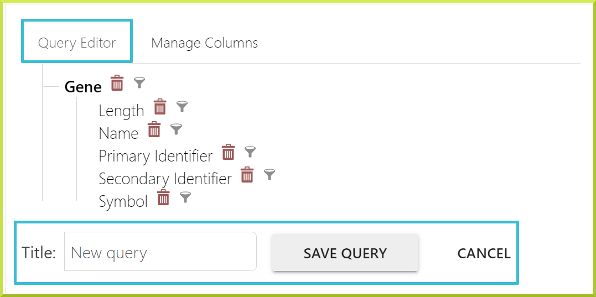

You can also save a query under the **Manage Columns** tab. 

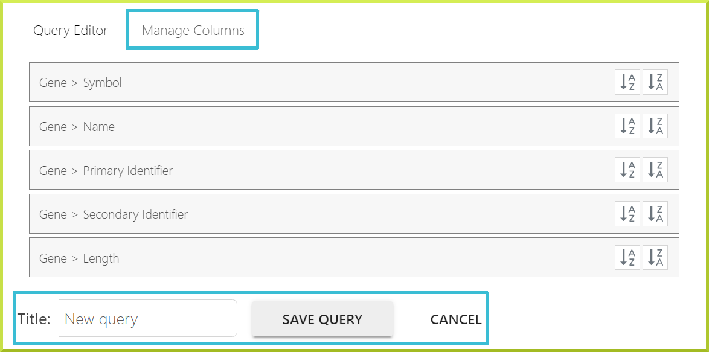


Further, you can export your query in XML under the **XML** tab. You can share exported queries with your colleagues or with the [InterMine team](contact-us.md) if you have any problems.  Queries can be imported in XML under the **Import from XML** tab and used in [**GET**](https://www.w3schools.com/tags/ref_httpmethods.asp) ****and [**POST**](https://www.w3schools.com/tags/ref_httpmethods.asp) requests used by the [web services](http://iodocs.labs.intermine.org/). See the[ Overview - Query Editor](https://app.gitbook.com/@user-documentation-intermine/s/user-documentation/~/drafts/-MSYkZresZ229V1rlQ7V/content/user-documentation/the-query-builder#overview) ****tab for more information on saving and exporting queries. 

### Including NULL or NO VALUE in your search results

When using a “negative” search such as$$!=$$, it is important to also consider **NULL** values. **NULL** means a value is either unknown or not applicable. When using the$$!=$$constraint, the search will not consider fields which have a **NULL** or **NO VALUE**. For instance, the Gene class has a symbol field. In most cases, this field is populated with the gene symbol; however, if a particular gene does not have a symbol, then this field will have **NO VALUE** in the symbol field. The$$!=$$constraint will include all genes that satisfy the search condition while excluding genes which do not match the search term, including genes without a symbol. However, if you are trying to exclude a defined gene or set of genes, you probably also want to include genes where the gene symbol **IS NULL**. 

* For Example, If you try a query that only shows all genes where the gene name doesn’t equal a given name \(e.g. $$!=$$ BHV4\), this constraint will also exclude **NULL** values from the results. In such a case, you probably want your query to return all genes where the name does not equal “BHV4” **AND** also include genes that do not have a name in your query results. For genes that do not have a name, the name field shows **NO VALUE,** which is different to empty.

You can try this query in HumanMine by pasting the query's XML under the [XML](https://app.gitbook.com/@user-documentation-intermine/s/user-documentation/~/drafts/-MShHhOJ-sA3leT4UY29/content/user-documentation/the-query-builder#overview) tab: 

```text
<query model="genomic" view="Gene.symbol 
       Gene.name Gene.primaryIdentifier 
       Gene.secondaryIdentifier 
       Gene.length Gene.organism.name" 
       constraintLogic="(A and B)" sortOrder="">
   <constraint path="Gene.name" 
   value="BHV4" op="!=" code="A"/>
   <constraint path="Gene.organism.name" 
   value="Mus musculus" op="=" code="B"/>
</query>
```

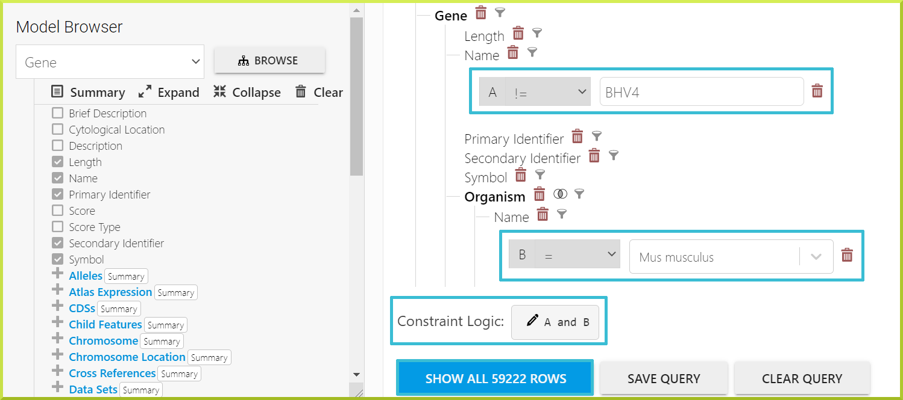

The query returns 59222 rows. So the results didn't return the one gene with a gene name of “BHV4” **AND** all genes with **NULL** **- No Value -** for the gene name field. 

Let's update the previous query and add an additional constraint as follows: 

```text
<query model="genomic" view="Gene.symbol 
Gene.name Gene.primaryIdentifier 
Gene.secondaryIdentifier 
Gene.length Gene.organism.name" 
constraintLogic="((A or C) and B)" sortOrder="">
   <constraint path="Gene.name" value="BHV4" 
   op="!=" code="A"/>
   <constraint path="Gene.name" op="IS NULL" 
   code="C"/>
   <constraint path="Gene.organism.name" 
   value="Mus musculus" op="=" code="B"/>
</query>
```

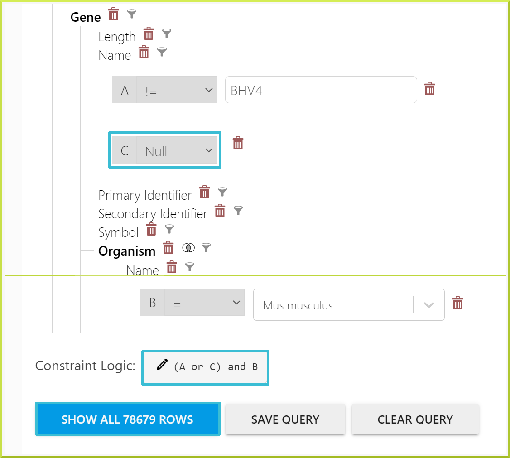


Remember to change the constraint logic to \(A or C\) and B.


We now get 78, 679 rows - this result includes all genes where the gene name is not BHV4, including genes with a NULL or No Value in the name field.

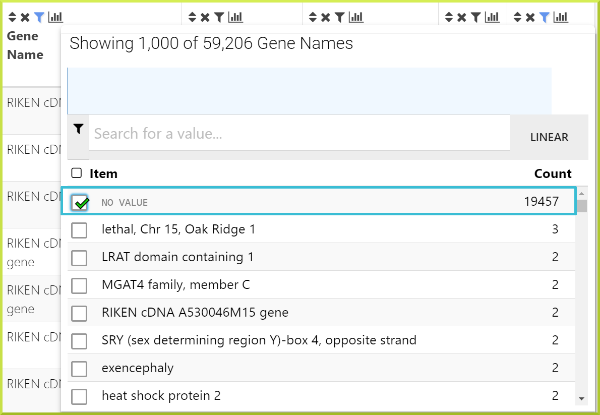


To add the **NULL** constraint, use the filtericon to add a new constraint and select the **NULL** from the drop-down menu. 


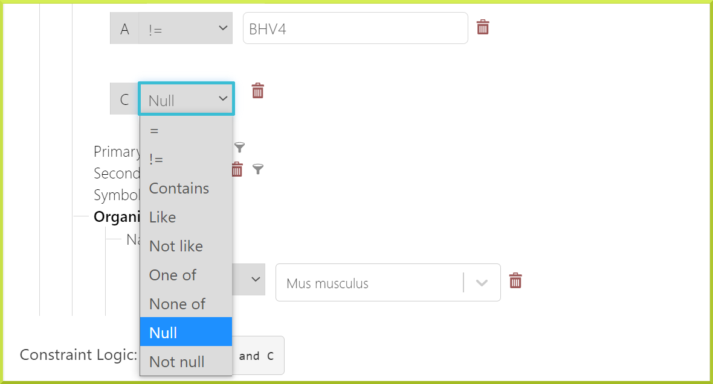

## Troubleshooting

### Why do I keep getting “No results” for my search?

Sometimes your search gives “No results” because one part of your search does not yield results. If you have several constraints, try removing only one at a time to see if you will get results. Alternatively, toggle your constraints to an [outer join](https://app.gitbook.com/@user-documentation-intermine/s/user-documentation/~/drafts/-MRV1dETGFXxj_SCpAD8/content/user-documentation/the-query-builder#outer-joins) from your results to see if there is data fulfilling that constraint; you can check [Outer joins](https://app.gitbook.com/@user-documentation-intermine/s/user-documentation/~/drafts/-MRV1dETGFXxj_SCpAD8/content/user-documentation/the-query-builder#outer-joins) for more details. If you still need additional help, please [Contact Us](contact-us.md).

### I am not sure how to start building a search; it looks hard!

Every template search can be displayed in the query builder. Try looking at some of the simple templates in the query builder and see how they have been constructed. Use this as a starting point to try changing a constraint or adjusting what is shown in the results table. If you need any help, please [Contact Us](contact-us.md).

To decide which class to select to begin building a query, think about the data you are trying to return. For example, suppose you want to know about the expression of a set of genes. In that case, you can start your query from Gene, where you can define which genes you are interested in and then navigate to the expression data, where you can determine what expression data you like to see. Similarly, you could construct the same query by defining the expression data. Expression data links to Genes, which allows you to add your gene constraints.

### I can’t find the data I am looking for in the model browser!

The data browser is based on the sequence ontology and follows the logical relationships found in biological data. **For example, Exons are referenced from Gene and Protein domains are referenced from Protein**. Many additional classes and fields have been added that also follow logical biological relationships. So if you are looking for Gene expression data, you will find this referenced from Gene. For details of all the data sources loaded to see the **Data** tab. If you need additional help, please Contact Us.

### I don’t understand what a field/class means.

Some fields have an information icon which provides an additional description of those fields. If you are unsure of a field’s contents, you can add it to your results and run the query. Most queries give results immediately, which allows you to adjust the columns you want to include in your results and fine-tune your query. It is also possible to do this from within the **Results Tables**. If you need additional help, please [Contact Us](contact-us.md). 

### How do I navigate to a class I have constrained without having to go through the model browser again?

Clicking on a class name in the right-hand Summary pane will open the model browser at that class.

