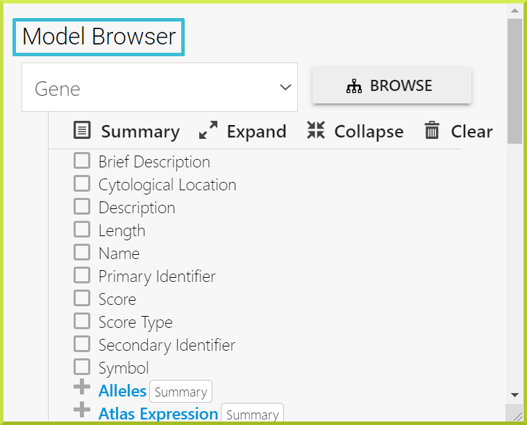
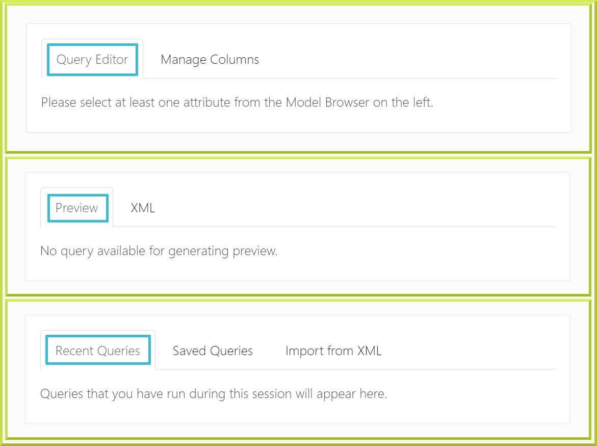

# The Query Builder

## The Query Builder

The Query Builder is InterMine’s custom query building interface,  allowing you to create and save your own searches. Users usually use this flexible interface to construct their own data mining queries. The QueryBuilder lets you view the data model, apply constraints and select your preferred output. To access the query builder, click on the **Query Builder** tab in the top navigation bar. 

### Constructing queries

The main query builder page is divided into four main sections, the Model/data browser, the Query editor, the Preview window, and the Query history. 

There are three steps to construct a query, which you need to repeat for any further data required:

1. Navigate the model/data browser to find the class or attribute you need.
2. Add the appropriate constraints - or filters - to selected class/attribute
3. Decide on the columns you want to view in your results.

 These steps are explained in more detail below. 

### Navigate the data browser

The left-hand pane of the query builder is a model browser. This allows you to navigate through all the data classes from your defined starting point. The classes are linked through logical references - for instance from Gene you can navigate to Proteins, Transcripts and microarray data etc. The classes and references will of course vary for each InterMine. Every class of data has certain attributes \(fields\) associated with it. For instance, a gene has a primary identifier, name and symbol among others. Use the model browser to navigate to the data you are interested in searching. For example, to get to protein domains from the starting point ‘Gene’, you would expand the Protein class first and then the protein domain class. For each class and attribute in the model browser, there is a **show** button and a **constrain** button. These are used to add data to your results and add filters to the data as described below.

### Add a constraint - filter - to your query

Once you have navigated to the data you want to search, you can now add a constraint to return only the set of that data you are interested in. For example, if you want to return all genes which code for proteins with homeo domains, you would add a constraint to the ‘name’ attribute of the protein domain class. The type of constraint you can add depends on the class and attribute. For some, you may just have to add some text. Others may require you to select from a drop-down list. Some will allow you to choose a list of saved objects, e.g. a list of genes. You can add as many constraints as you wish to build up your query. Don’t forget you are building a query from scratch so you may need to put in constraints to limit the organism or the set of genes. The set of constraints you have added is shown in the right-hand pane of the query builder.

HINT: To navigate back to a place in the model browser click on the class name in the right-hand pane:

### Choose the data you want in your results

Every attribute has a **Show** button. Clicking on this will add that attribute to your select list \(shown below the query builder\). Each attribute will become a column in your results table when you run your search:

### Run your search

Once you are happy with your query and the attributes you have selected for your results, press **Show All Rows** to run your search. Your results will be displayed in our [Results Tables](https://flymine.readthedocs.io/en/latest/results-tables/Documentationresultstables.html#resultstables).

## Advanced features of the query builder

### Subclasses

Some classes have subclasses - i.e. more specialised sets of the main class. For example, the Transcript class in FlyMine has the subclasses mRNA, miRNA, ncRNA, rRNA, snRNA, snoRNA and tRNA. To constrain a class to its subclass, click on the ‘constrain’ next to the class name and select the subclass from the drop-down list. Classes which have subclasses are indicated as shown below:

### Outer joins

When adding a constraint to a query, you need to also consider whether you want this constraint to limit your results to just those items with that information or if you want your results to show all the items and the new feature if it exists. For example, if you are adding a constraint to the protein domain class for homeobox, and selecting to show genes and proteins in your results, do you want your results to show:

1. Only genes and proteins which contain a homeobox \(inner join\)
2. All genes and proteins and indicate which contain a homeobox. \(outer join\)

The default constraint is always A \(inner join\). i.e. the record you are searching must have information in the field the path describes. However, you can change the logic to B using the outer-join. To do this, add your constraint in the usual way. The outer-join icon is found in the right-hand pane next to your constraint. Click on this to change the logic of your constraint:

Note that the column summary and filtering still applies to the results table as a whole

### Loop queries

It is possible to constrain a class to the result of a constraint in another class. For example, if you search for GO terms and their children, you need to constrain the Parents.GO term collection to the GO term you are searching for and ‘show’ the Ontology term.GO terms for the children. However in doing this, if you select to show the columns ‘Parents.Go term.name’ and ‘Ontology term.Go term.name’, the parent term will appear in both columns. However by putting in a loop constraint on the GO term that says this field should not be equal to the GO term parent field, then the parent will now only be shown in the parent column:

### Constraint logic

You can set the constraint logic for your query under the right-hand summary pane. Each constraint is assigned a letter - which can be found in the summary pane. The constraint logic accepts: AND and OR and NOT logic.

### Saving and exporting your query

If you are logged in you can save a query you have constructed permanently to your account. The ‘save’ option is found at the bottom of the query builder page. You can also export your query as XML. This can be re-imported into the query builder and so is a useful way to share queries with your colleagues \(or to send to us \([Contact Us](https://flymine.readthedocs.io/en/latest/contact/Documentationcontact.html#contact)\) if you are having problems with a query\). Queries in XML can also be used in GET and POST requests used by the [web services](http://iodocs.labs.intermine.org/).

### The difference between NULL and NOT EQUALS

Searching Null vs NOT EQUALS

When using a “negative” search such as !=, it is important to understand the difference between a NULL value and an empty value. NUll means a value that is unknown or not applicable. Empty means known but not present. This has implications for the way you may construct a query.

For Example: If you try a query such as “Give me all genes where the gene name doesn’t equal something \(e.g. ACXE\)” it excludes all the null values from the results too. In such a case you probably want the query to return all genes where the name does not equal “ACXE” AND those that do not have a name. For those that do not have a name, the field is NULL \(which is different to empty\).

For example, try this query in FlyMine:

It returns 7627 genes. So from the total fly genes, it has not returned the one gene that has the name ACXE AND all the genes which are “NULL” for gene name.

Now, if we add an additional constraint:

\(NOTE: also change the constraint logic to C or B\)

We now get 18, 059 rows - this is all the genes which do not have name ACXE and all genes which have a NULL name.

Note: To add the “NULL” constraint, select “Filter query results on this field having any value or not” and select the “Has no value” checkbox:

## Troubleshooting

### I keep getting ‘No results’ for my search.

Sometimes your search gives “No Results” because one part of your search does not yield results. If you have several constraints, try removing only one at a time to see if you will get results. Alternatively, toggle your constraints to an [outer join](https://app.gitbook.com/@user-documentation-intermine/s/user-documentation/~/drafts/-MRV1dETGFXxj_SCpAD8/content/user-documentation/the-query-builder#outer-joins) from your results to see if there is data fulfilling that constraint; you can check [Outer joins](https://app.gitbook.com/@user-documentation-intermine/s/user-documentation/~/drafts/-MRV1dETGFXxj_SCpAD8/content/user-documentation/the-query-builder#outer-joins) for more details. If you still need additional help, please [Contact Us](contact-us.md).

### I am not sure how to start building a search, it looks hard?

Every template query can be displayed in the query builder. Try looking at some of the simpler template searches in the query builder and see how they have been constructed. Use this as a starting point to play around with changing a constraint or change what is shown in the results table. If you need extra help, please [Contact Us](contact-us.md).

To decide which class to select to begin building a query think about the data you are trying to return. For example, if you want to know about the expression of a set of genes, you can start your query from Gene, where you can define which genes you are interested in and from here navigate to the expression data, where you can define what expression data you which to see. However, you could construct the same query by starting from the expression data and defining this first. The expression data links to Genes and so you can then add your gene constraint.

### I can’t find the data I am looking for in the model browser

The data model is based on the sequence ontology and so follows the logical relationships found in biological data - i.e. Exons are referenced from Gene and Protein domains are referenced from Protein. Many additional classes and fields have been added and these also follow logical biological relationships. So if you are looking for Gene expression data, you will find this referenced from Gene. For details of all the data sources loaded to see the [Data](https://flymine.readthedocs.io/en/latest/data/Documentationdata.html#data) tab. If you need additional help, please [Contact Us](contact-us.md).

### I don’t understand what this field/class means.

Some of the fields have an information icon which provides an additional description of the field. Otherwise, if you are unsure of the contents of a field, add it to your results and run the query. Most searches run very quickly so it is easy to move to and from the results while you fine-tune your query. It is also possible to do this from within the [Results Tables](https://flymine.readthedocs.io/en/latest/results-tables/Documentationresultstables.html#resultstables). If need additional help, please [Contact Us](contact-us.md).

### How do I navigate to a class I have constrained without having to go through the model?

### browser again?

Clicking on a class name in the right-hand summary pane will open the model browser at that class.

