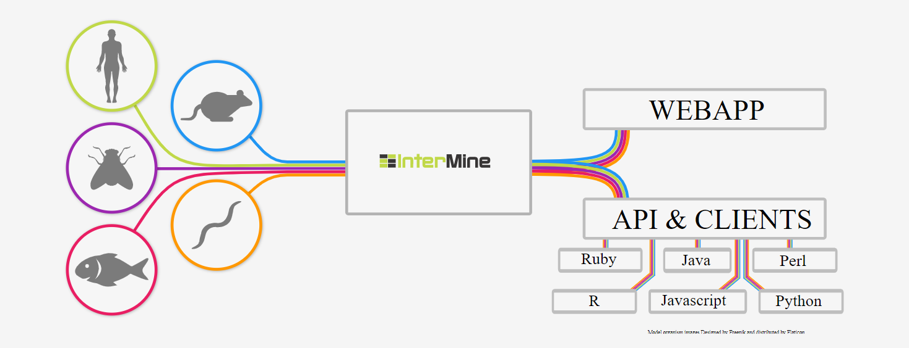

# What is InterMine?

### Disparate data in, unified data out

InterMine is a data warehouse system that integrates biological data sources, making it easy to query and analyse data. It is an [open source](https://github.com/intermine/intermine) project that is free to use under the open source [LGPL](http://www.gnu.org/licenses/lgpl.html) license and that can be [installed on your own servers](http://intermine.readthedocs.io/en/latest/get-started/) to make data available on the web.

### There's an InterMine for \(almost\) anyone

There are many different InterMines worldwide, covering a broad range of model organisms and life science research areas, including:

* [FlyMine](https://www.flymine.org/)
* [HumanMine](https://www.humanmine.org/)
* [MouseMine](http://www.mousemine.org/)
* [YeastMine](https://yeastmine.yeastgenome.org/)
* [ZebrafishMine](http://zebrafishmine.org/)
* [RatMine](http://ratmine.mcw.edu/ratmine/begin.do)
* [TargetMine](http://targetmine.mizuguchilab.org/)
* [ThaleMine](https://apps.araport.org/thalemine)
* [PhytoMine](https://phytozome.jgi.doe.gov/phytomine)

For the full list of InterMines, please see the [registry](http://registry.intermine.org/)

### With InterMine you can: 

* Query across several data sources at once
* Data formatting issues resolved
* Identifier resolution system
* Collate information about items and sets
* Common platform to many organisms and type of data
* Information without visiting several sites

